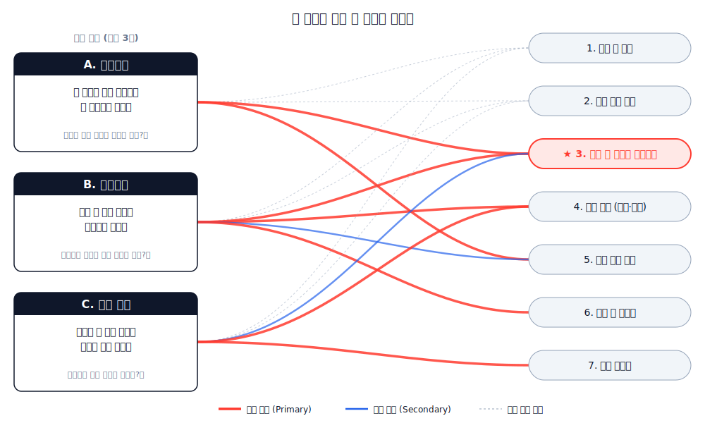

<!-- _class: lead -->

# 수능영어와 교육과정의 **괴리**

## 데이터와 **바이브 코딩**으로 해결책을 찾다

### 측정되지 않는 시장 70%를 제품화하는 EdTech 전략

<br>

**대상**: EdTech 경영자 · 프로덕트 의사결정자
**일시**: 2026.05.25 · 45–55분
**근거**: 4년 누적 47+ 모듈 (`smilepat/myprojects` 외 6개 레포)

<!-- 발화: 경영자에게 — 측정되지 않는 70%가 다음 5년의 EdTech 격전지. 한 사람+AI 팀이 4년에 만든 청사진을 함께 검토. -->

---

## 30% · 70% — **시장의 진짜 모양**

# 성취목표 도달 **30%**.
# 측정되지 않은 **70%**가, 시장입니다.

<br>

- **30%** — 국가 영어 교육과정 성취목표 도달 비율
- **70%** — *어디서 막혔는지 모르는 학생들* = 측정되지 않는 시장
- **현재 EdTech 다수**: 30%의 *상위*를 두고 경쟁 — 학원 시장과 동일 좌표
- **이 강의의 명제**: 70%를 *측정 가능하게 만드는 자*가 다음 EdTech 격전지의 승자

> 시험은 결과만 본다. 그 사이 *흐름·역량*은 측정되지 않는다.
> 측정되지 않는 것은 *제품화*되지 않는다.

<!-- 발화: 30 vs 70이 시장 정의 — 경쟁사들이 30%에서 싸우는 동안 우리는 70%를 측정 가능하게 만든다. 이게 차별화 좌표 -->

---

<!-- _class: part -->

# Part 1

## 갭이 존재한다 — **5개의 정량 증거**

> 교과과정의 약속과 수능의 요구 사이엔 *수학적·구조적 갭*이 있다.
> 학생의 노력 부족이 아니라 좌표계가 다르다.

<!-- 발화: 5장에 걸쳐 데이터로만 보여준다 — 이후 슬라이드에서 "왜"가 나옴 -->

---

## P1-1 │ 4축 평가 비대칭 — **좌표계 자체가 다르다**

| 축 | 학교 내신 | 수능 |
|---|---|---|
| 문항 유형 | 어휘·문법 객관식, 본문 암기 | 추론·빈칸·함의·요약 |
| Bloom 인지 수준 | **하위** (기억·이해) | **상위** (분석·평가) |
| 시간 압박 | 낮음 | *문항당 93초* |
| D5 전략 측정 | 거의 없음 | *결정 변수* |

> **귀결:** *"학교 1등급 → 수능 3등급"* 현상은 학생의 노력 부족이 아니라
> **측정 좌표계 자체가 달라서** 발생.
> 이 좌표계 통합이 곧 *제품 차별화 좌표*.

<!-- 발화: 강의 전체의 thesis — 좌표계가 다르다는 사실 자체가 시장 기회. 이 비대칭을 측정 가능하게 만드는 제품이 70%를 점유. -->

---

## P1-2 │ Lexile + 학습 시간 — **수학적으로 도달 불가**

| 지표 | 한국 평균 | 목표 | 갭 |
|---|---:|---:|---:|
| 고3 평균 Lexile | **950L** | 수능 1,100–1,300L | *−250L* |
| 누적 학습 시간 (초3–고3 10년) | **980h** | CEFR B1: 1,200–2,000h | *−220–1,020h* |
| 누적 영어 읽기 노출량 | 167K–220K 단어 | 미국 학생: **9.75M** | *약 1/44* |

> **MetaMetrics 2023**: *"43%의 한국 고3이 1000L 미만"* — 수능 지문 진입 자체가 불가.
> 현재 시수만으로는 *B1조차 수학적으로 불가능* → 사교육 의존이 *경제적 선택*이 아닌 *수학적 필연*.
> 이 *수학적 필연*이 곧 EdTech의 *지속 수요*.

<span class="footnote">출처: `Korea_English_Solution/EDUCATION_ANALYSIS.md` §1.1–1.2 · MetaMetrics 2023 Korea Report</span>

<!-- 발화: 사교육 시장이 사라지지 않는 구조적 이유 — 정규 시수 자체가 부족. 70% 시장의 *지속성* 증명. -->

---

## P1-3 │ 격차율 누진 — **시간이 흘러도 메워지지 않는다**

| 학년 | 격차율 | 주요 결손 영역 |
|---|---:|---|
| 초6 | 35% | 기본 구문 이해 |
| 중3 | 58% | 복합문 분석 |
| 고2 | **72%** | *추론적 독해* |

```
초6 ▓▓▓▓▓▓▓░░░░░░░░░░░░░ 35%
중3 ▓▓▓▓▓▓▓▓▓▓▓▓░░░░░░░░ 58%
고2 ▓▓▓▓▓▓▓▓▓▓▓▓▓▓▓▓▓░░░ 72%
```

> 격차는 학년이 올라갈수록 *더 빨리* 커진다 → **고2에서 메꿀 수 없음**.
> 조기 진단·개인화의 정량 근거. *늦은 발견*은 곧 *영구 결손*.
> = **early acquisition = retention 자산**. 일찍 잡는 제품이 LTV 압도.

<span class="footnote">출처: GEPS 2017–2022 · CSAT 텍스트 분석 · 2023 수능 33번 분석</span>

<!-- 발화: 누진 곡선 = 조기 시장 진입의 ROI 증명. 초·중에서 학생을 잡으면 고등까지 retention 가능 → 다년 LTV. -->

---

## P1-4 │ 교육과정 vs CEFR — **모든 학년이 목표 미달**

| 학교급 | 학년 | 한국 목표 | CEFR | 실제 도달 |
|---|---|---|---|---|
| 초등 | 3–4 | 기초 의사소통 | **A1** | A1 미만 ⚠ |
| 초등 | 5–6 | 친숙 주제 듣/말 | A1~A2 | A1 |
| 중학 | 1 | 일상 듣/읽 이해 | A2 | A1~A2 |
| 중학 | 2–3 | 친숙 주제 말/쓰기 | A2~B1 | A2 |
| 고등 | 1 | 복합 이해·표현 | **B1** | A2~B1 |
| 고등 | 2–3 | 추상 주제 해석 | **B1~B2** | *B1 미만* ⚠ |

> 누적 효과로 고2–3에서 **B1 미만 다수**. 개별 학년 갭이 아니라 *시스템 갭*.
> = *단일 학년 솔루션*이 아니라 *K-12 종단 좌표계*가 답.

<!-- 발화: 단일 학년·단일 유형 솔루션은 부분 최적. 좌표계 통합 = 전 학년 횡단 제품의 정당성. -->

---

## P1-5 │ Part 1 정리 — **갭은 한 차원이 아니다**

- *언어학적 갭* — Lexile 250L
- *시간적 갭* — 220–1,020시간
- *입력량 갭* — 1/44 노출
- *인지적 갭* — Bloom 하위 vs 상위
- *시스템적 갭* — 모든 학년에서 목표 미달

> **공통 원인:** 측정 좌표계가 통합되지 않은 채 *결과만* 평가한다.
> "**좌표계를 통합**하면 갭이 *측정 가능한 거리*가 된다."
> = *측정* → *제품화* → *진입장벽* 의 첫 단추.

<!-- 발화: Part 1 closer — 측정 좌표계가 다음 EdTech의 첫 단추. 측정 못 하는 회사는 진단·처방·moat 어느 것도 못 만든다. -->

---

<!-- _class: part -->

# Part 2

## 갭을 메우는 법 — **역량 분해와 지도화**

> 수능 영어를 푼다는 건 **12개 micro-skill의 조합 동작**이다.
> 분해 → 지도화 → 우선순위 = 일괄 커리큘럼의 종언.

<!-- 발화: 이 Part가 강의의 핵심 — 한 문항이 단일 능력이 아니라는 패러다임 전환 -->

---

## P2-1 │ 핵심 통찰 — **한 문항은 여러 역량의 결합**

> 같은 문제, 다른 *역량*의 조합.
>
> *수능 문항은 단일 능력이 아니라 여러 역량의 결합이다.*
> *그래서 학습 처방의 단위는 "유형"이 아닌 "역량"이어야 한다.*

<br>

**전통적 접근:** "유형별 문제풀이" → 문항이 분류되지만 *역량*은 안 보임
**역량 기반 접근:** 각 문항을 *역량 벡터*로 분해 → 결손 역량이 보임 → 다수 유형 동시 개선

<!-- 발화: "유형별 풀이"는 학원의 코어 비즈니스 — 우리는 그 위 레이어인 "역량 단위 처방"으로 차별화. 학원이 못 따라오는 좌표. -->

---

## P2-2 │ 양분 그래프 — **문항 ↔ 역량 매핑** (시각 증거)



**왼쪽**: 수능 문항 3개 (주제파악·빈칸추론·글의 순서)

**오른쪽**: 필요한 역량 7개

★ **3번 "같은 말 다르게 알아보기"** = 3개 문항 *모두*에 필요한 핵심

> 한 역량 보강이 다수 문항을 동시에 끌어올린다 = **skill leverage**.

<!-- 발화: 5초 시각 — 학부모·교사·임원 누구에게 보여도 즉시 이해. 제품 마케팅의 1순위 자산. -->

---

## P2-3 │ 12 micro-skill 좌표계 — **3 Layer · 12 skill**

| Layer | Skill 코드 | 이름 | 1등급 목표 |
|---|---|---|---:|
| **A 어휘·구문** | A-01 | 어휘 의미 변별 | 85 |
| | A-02 | 구문 분석 | 80 |
| | A-03 | 절 경계 | 80 |
| | A-04 | 수식어 연결 | 75 |
| **B 응집·맥락** | B-01 | 지시 추적 ★ | 80 |
| | B-02 | 논리 전환 ★ | 85 |
| | B-03 | 패러프레이즈 ★ | 80 |
| | B-04 | 어휘 연쇄 | 75 |
| **C 추론·고차** | C-01 | 주제 도출 ★ | 90 |
| | C-02 | 암묵적 추론 | 85 |
| | C-03 | 필자 의도 | 80 |
| | C-04 | 논증 구조 | 80 |

<span class="footnote">출처: `csat-text-graph-maker/src/lib/logicflow/micro-skills.ts` `GRADE1_TARGETS`</span>

<!-- 발화: 12개 skill로 분해 — 이게 콘텐츠 카탈로그·진단 리포트·교사 대시보드의 단위. 12개가 그대로 P&L 차원. -->

---

## P2-4 │ 19 수능 유형 ↔ 12 skill — **다대다 매핑**

| 수능 유형 | Primary Skill | Secondary |
|---|---|---|
| 빈칸추론 | C-02, B-03 | A-01, A-02 |
| 순서배열 | B-02, B-04 | B-01 |
| 문장삽입 | B-02, B-01 | B-03 |
| 무관문장 | C-01, B-02 | B-04 |
| 주제·제목 | C-01 | B-03, C-03 |
| 요지·요약 | C-01, C-03 | B-03 |
| 함의추론 | C-02 | B-03, C-03 |
| 어법 | A-02, A-03 | A-04 |
| 어휘선택 | A-01 | A-02, B-04 |
| 내용일치 | B-03, B-01 | A-01 |
| 장문 | C-01, C-02 | B-01, B-03 |

> 19개 유형이 12개 skill의 *조합*. 출처: `QUESTION_TYPE_SKILL_MAP` 전수 매핑.

<!-- 발화: 이 매핑 표 자체가 product moat — 19×12 매트릭스를 만드는 데 수년의 도메인 지식 누적. 신규 진입자는 못 만든다. -->

---

## P2-5 │ Skill Leverage — **B-03 1개 결함이 5개 유형을 무력화**

**B-03 "패러프레이즈 매핑"이 결함일 때 영향받는 수능 문항:**

```
B-03 (도달 40 / 목표 80, gap −40)
  ├─→ 빈칸추론      ⚠️
  ├─→ 요지·주제      ⚠️
  ├─→ 내용일치      ⚠️
  ├─→ 어휘 활용      ⚠️
  └─→ 공지문/도표    ⚠️
```

> *1개 skill 보강* = *5개 유형 동시 개선*.
> 학습 ROI가 skill별로 *수십 배 차이*가 난다 → "유형별 풀이"가 비효율적인 이유.

<!-- 발화: ROI 정량 증명 — 동일 학습 시간 대비 효과가 skill별로 5배 차이. 학습 시간 = 사용자 LTV의 핵심 metric. -->

---

## P2-6 │ 영향력 순위 — **3개 skill만 보강해도 13/19 커버**

| 순위 | Skill | Primary 유형 수 | Total (P+S) | 시사점 |
|---:|---|---:|---:|---|
| 🥇 | **B-01** 지시 추적 | 5 | **8/19** | 응집성 핵심 — 보강 효율 최대 |
| 🥈 | **C-01** 주제 도출 | 6 | 7/19 | Primary 최다 — 1등급 게이트 |
| 🥈 | **B-03** 패러프레이즈 | 5 | 7/19 | 5개 유형 일제히 무력화 가능 |
| 🥈 | **B-02** 논리 전환 | 3 | 7/19 | 흐름 이해의 허브 |
| ⬇ | A-04 / B-04 | 0–1 | 1–2/19 | leverage 낮음 — 후순위 |

> **B-01 + C-01 + B-03** 3개만 보강해도 *19개 중 13개 유형이 영향권*.
> 추천 알고리즘의 *우선순위 가중치*가 자동 도출됨.

<!-- 발화: 3개 skill = 13/19 커버 — Pareto가 그대로. 콘텐츠 투자도 3개에 집중하면 ROI 폭발. 콘텐츠 우선순위의 수학적 근거. -->

---

## P2-7 │ 선수관계 DAG — **학습 순서가 수학적으로 결정**

```
Layer A (어휘·구문)        Layer B (응집·맥락)       Layer C (추론·고차)
A-01 어휘 ───┬───────────→ B-01 지시추적 ★ ──┬──→ C-01 주제도출 ★
A-02 구문 ───┤───────────→ B-01            │ ┌→ C-02 암묵추론
   ├──→ A-03 절경계 ─────→ B-02 논리전환 ★ ─┘ │
   └──→ A-04 수식어        B-03 패러 ★ ─────┘ ┌→ C-03 필자의도
A-01 ────────────────────→ B-03           ──┘
A-01 ────────────────────→ B-04 어휘연쇄  B-02 ───→ C-04 논증구조
                                                C-01 ───→ C-03·C-04
```

> 한 학습자에게 **gap 크기만이 아니라 prereq 차단 여부**로 우선순위가 결정.
> *"순서 없는 우선순위"는 무의미*.

<span class="footnote">출처: `micro-skills.ts` `prerequisites` 필드 + `recommender.ts`</span>

<!-- 발화: 선수관계 = 콘텐츠 시퀀싱이 수학적으로 결정됨. 학원 강사의 노하우가 *제품화*되는 지점. 휴먼-디펜던시를 줄이는 자산. -->

---

## P2-8 │ 한 학생, 다섯 우선순위 — **개인화 처방**

| # | Skill | 현재 → 목표 | gap | recommender reason |
|---:|---|---:|---:|---|
| ① | A-02 구문 분석 | 60 → 80 | −20 | *선수 차단* — B-02·C-04 진행 불가 |
| ② | B-02 논리 전환 | 45 → 85 | **−40** | 집중 훈련 필요 |
| ③ | B-03 패러프레이즈 | 40 → 80 | **−40** | 5개 유형 동시 영향 |
| ④ | C-01 주제 도출 | 55 → 90 | −35 | B-01·B-02 충족 후 진입 |
| ⑤ | C-02 암묵 추론 | 35 → 85 | **−50** | B-03 보강 후 단계 진입 |

> 모든 학습자에게 *다른 top-5* → **일괄 커리큘럼의 종언**.
> 순서는 gap 크기가 아니라 *선수관계 우선*.

<!-- 발화: 이 표가 demo의 정점 — 학습자 1명에게 보여주면 즉시 결제. 영업·온보딩의 conversion lever. 일괄 커리큘럼 사업 모델의 종말. -->

---

<!-- _class: part -->

# Part 3

## 진단 없는 문제풀이의 **한계**

> 측정되지 않는 것은 개선되지 않는다.
> 같은 처방은 *다른 환자*에게 *같은 약*을 주는 것과 같다.

<!-- 발화: 진단의 필요성을 4장에 걸쳐 못 박는다 -->

---

## P3-1 │ "유형별 문제풀이"의 **천장**

- *유형 풀이* — 같은 유형의 정답률은 올라가나 *역량*은 그대로
- *반복 노출* — 새로운 지문에서 동일 결손이 재발
- *측정의 부재* — 어느 *역량*이 어디서 막혔는지 *데이터 없음*
- *처방의 추측* — "다 풀어봐라"는 처방이 아닌 *방치*

> 학원의 흔한 진단: "잘하는 유형 / 못하는 유형."
> *역량 진단 없이 유형만 본다* = *증상만 보고 원인을 모름*.

<!-- 발화: 학원 vs 진단 기반 EdTech의 차별점 / 경영자: 이게 새 시장의 입구 -->

---

## P3-2 │ Performance Descriptor 5축 — **모든 축이 ½ 미만**

| 축 | 목표 | 고2 실측 | 갭 |
|---|---:|---:|---:|
| 문법 정확성 | 80 | 35 | −45 |
| 어휘 다양성 | 75 | 25 | −50 |
| 논리 구성력 | 70 | 20 | −50 |
| 창의성 | 65 | 15 | −50 |
| **맥락 적절성** | 75 | **5** | *−70* |

> 5축 모두 *목표의 ½ 미만*. 특히 **맥락 적절성 5점**(목표 75) = *D5 전략 차원의 사각지대*.
> Skill map(P2-3)과 *독립 출처*에서 같은 결론.

<span class="footnote">출처: 한국교육과정평가원 Performance Descriptor · `Korea_English_Solution/charts.tsx::RadarChart`</span>

<!-- 발화: 외부 데이터에서도 같은 결론 — 우리 가설이 single source 의존 아님 -->

---

## P3-3 │ 학습 결손 분포 — **어휘·문법·독해 = 75%**

```
어휘력 부족        ████████████████████████████ 30%
문법 이해 부족    ███████████████████████ 25%
독해력 부족        ██████████████████ 20%
듣기 이해 부족    ███████████ 15%
말하기/쓰기      ██████ 10%
                ─────────────────────────
                                          합계 100%
```

> 합계 어휘+문법+독해 = *75%* → Layer A·B(어휘·구문·응집성)와 *직접 대응*.
> *음성·생산*은 시험 비중이 낮아 후순위지만 결손은 동등.

> **다른 환자, 같은 약** — 같은 반 30명에게 같은 교재. 진단 없는 일괄 처방.

<span class="footnote">출처: 2022–2023 영어교육 실태조사 · `Korea_English_Solution/charts.tsx::PieChart`</span>

<!-- 발화: "다른 환자 같은 약" 비유가 가장 강력한 청중 hook / 학부모에게도 통함 -->

---

## P3-4 │ 명제 — **진단이 출발점**

> *학습자 진단 + 역량 진단*이 *없는* 문제풀이는
> *증상만 다스리는 처방*이다.
>
> **진단 → 분해 → 처방 → 재진단**의 *닫힌 루프*가
> 갭을 *측정 가능한 거리*로 바꾼다.

<br>

**경영자 관점**: 진단 데이터가 *제품 moat*. 누적될수록 정확해짐 = 데이터 네트워크 효과.

**개발자 관점**: 진단 = 좌표 출력. 출력 좌표 → 추천 → 콘텐츠 → 재진단의 *닫힌 함수형 루프*로 구현.

<!-- 발화: Part 3 closer — 진단이 제품의 입구. "진단 없는 EdTech은 컨텐츠 카탈로그일 뿐"이라는 명제로 못 박음. -->

---

<!-- _class: part -->

# Part 4

## 바이브 코딩으로 **만들 수 있다** — 실행 증거

> 한 사람 + AI = 4년에 47+ 모듈·137,745 문항·9,017 진단 캘리브레이션.
> *경영자가 알아야 할 것*: 이게 *왜 가능*해졌고, *어디까지* 구현되었는가.

<!-- 발화: 경영자의 첫 질문은 "우리도 만들 수 있나?" — 이 Part가 그 답. 빅테크 팀이 아니어도 도달 가능한 깊이. -->

---

## P4-1 │ IRT 1PL Rasch — **학습자·문항을 같은 좌표 위에**

| 항목 | 값 | 경영자 관점 |
|---|---|---|
| 모델 | **1PL Rasch** (a 고정 1.0) | 검증된 측정 이론 (50+ 년) |
| `b_value` 범위 | **−3.00 ~ +3.67** | 9,017문항 캘리브레이션 완료 |
| 학습자 능력 θ | 같은 척도 (−3 ~ +3) | *공식 진단 리포트 단위* |
| 거리 계산 | `gap = b_target − θ_current` | 학습자에게 보여줄 *수치 KPI* |

> 학습자도, 문항도, 목표도 *동일 척도*. *"어렵다/쉽다"가 아니라 수치로 정의되는 거리*.
> 이 좌표가 곧 *학부모에게 보여줄 리포트의 단위*이자 *데이터 네트워크 효과의 축*.

<span class="footnote">출처: `md-graph-db/docs/IRT_CALIBRATION_GUIDELINE.md` · 검증 모델은 GMAT·TOEFL과 동일 계열</span>

<!-- 발화: 진단 정확도 = product moat. b 데이터가 쌓일수록 정확 → 후발주자가 못 따라옴. GMAT이 갖는 진입장벽과 동질. -->

---

## P4-2 │ 적응형 진단 + 4단계 마스터리 게이트

**적응형 진단 (CAT) — 풀이 단계 50% 단축**

```
사전정보 (학년·CEFR) → Warm-start
   ↓
출제 → 정답이면 θ̂ ↑ / 오답이면 θ̂ ↓ → 수렴(SE<0.3)까지 반복
```

> 고정형 진단 30문항 → CAT *15문항*으로 동일 정확도 (Wainer 2000).
> = **사용자 이탈률 감소** · **온보딩 conversion 향상**.

**Mastery Levels** — 학부모/교사가 즉시 이해하는 4단계

| 점수 | 라벨 | 의미 | 마케팅 메시지 |
|---:|---|---|---|
| 0–30 | Novice | 핵심 결함 | "여기서 시작합니다" |
| 31–60 | Developing | 교과과정 평균 | "다수가 머무는 구간" |
| 61–85 | Proficient | 수능 2–3등급 | "탈출 임계점" |
| **86–100** | **Mastered** | *수능 1등급* | "도달" |

<!-- 발화: 진단 UX가 conversion에 직결 — 30문항이 길어서 이탈. 15문항으로 짧아지면서 정확도 유지. 4단계는 LMS/학부모 리포트 그대로. -->

---

## P4-3 │ Recommender — **학원의 처방을 코드로**

**알고리즘의 본질** (2축 정렬)

1. **선수 차단**(prerequisite unmet) skill을 먼저 — 무엇을 해도 못 푸는 skill부터
2. 같은 차단도 안에선 **gap이 큰 순** — 학습 효과 큰 것부터

| 분기 | 학습자에게 보여주는 reason |
|---|---|
| `gap > 30` | *"집중 훈련 필요"* |
| `15 < gap ≤ 30` | "보완 필요" |
| `gap ≤ 15` | "근접, 마무리" |
| prereq 미충족 | *"선수 [○○] 먼저"* |

> = **학원 베테랑 강사의 노하우를 알고리즘화**.
> 한 학생당 *다른 top-5* → 일괄 커리큘럼 SaaS와 즉시 차별화.
> 휴먼-디펜던시 제거 = 인건비 → 데이터 자산으로 *이전*.

<span class="footnote">코드 위치: `csat-text-graph-maker/src/lib/logicflow/recommender.ts`</span>

<!-- 발화: 사람만이 할 수 있던 진단·처방을 코드화 = unit economics 근본 변화. 강사 1명당 학생 20명 → 시스템 1개당 학생 무한대. -->

---

## P4-4 │ AI 생성 품질 게이트 — **LLM의 약점 해결**

**경영자가 흔히 듣는 우려**: *"LLM이 만든 문제는 못 믿는다 (hallucination)."*

**답**: 3-Layer × 9 검증기로 **분류·자동수정·재시도**.

```
지문 + 유형 → Stage 1 분석 → Stage 2 생성
                          ↓
                3-Layer × 9 검증기
                ├─ L1 구조  · L2 내용  · L3 수능 적합성
                          ↓
                Issue Code 분기 (60+ 코드)
                ├─ error    → 재시도 (피드백 자동)
                ├─ warning → autoRepair (자동 수정)
                └─ pass     → 학습자에게
```

| 영역 | 코드 수 | 예 |
|---|---:|---|
| 지문(P0xx) / 문제(Q0xx) / 선택지(O0xx) | 12+8+18 | *O003 오답 매력도 낮음* |
| 정답(A0xx) / 형식(F0xx) / 세트(S0xx) | 6+10+6 | S001 공통지문 불일치 |

> **PASS/FAIL이 아니라 *분류된 처방*** = *프로덕션 reliability*.
> 학원·출판사가 *사람으로* 하는 검수를 *시스템으로* — 한계비용 0에 수렴.

<!-- 발화: LLM 우려를 정면 돌파 — 60+ 코드 분류가 곧 신뢰의 데이터화. 경쟁사가 LLM 그대로 쓸 때 우리는 검증 레이어로 차별. -->

---

## P4-5 │ 자산 규모 — **한 사람 + AI · 4년 누적**

| 자산 | 규모 | 비고 |
|---|---:|---|
| 마스터 어휘 | **9,183 단어 × 58 속성** | 단순 단어장 아닌 *속성 매트릭스* |
| IRT 진단 문항 | **9,017** | 캘리브레이션 완료 (b ∈ [−3, +3.67]) |
| 학습 스캐폴딩 | **137,745 문항** | 9,183 × 5D × 3 step |
| 수능 유형 풀커버리지 | **44** | LC 16 + RC 28 |
| 유형별 프롬프트 라이브러리 | **41** | 224KB · 버전 추적 |
| 모듈러 검증기 | **9** | LLM 품질 게이트 |
| 전체 모듈 | **47+** | 7개 레포 분산 |

> 핵심은 *양*이 아니라 **구조화된 자산의 폭**.
> 신규 진입자가 *맨땅에서* 따라오려면 *수년의 도메인 지식*과 *LLM 비용 누적*이 필요.
> = **moat**가 *추상*이 아니라 *측정 가능한 깊이*.

<span class="footnote">생성: Gemini 2.5 Flash × 45,915 호출 + 검증기 layered pipeline · 솔로 개발자 4년</span>

<!-- 발화: 솔로 + AI가 4년에 만든 깊이. 직원 30명 EdTech 회사가 4년 걸려도 따라오기 어려운 구조. 바이브 코딩의 진짜 의미. -->

---

## P4-6 │ Before / After — **8주 후 좌표 이동 (예시)**

| Skill | Before (W0) | After (W8) | Δ |
|---|---:|---:|---:|
| A-01 어휘 | 65 | 78 | +13 |
| A-02 구문 | 60 | 75 | +15 |
| B-01 지시 | 50 | 72 | **+22** |
| **B-03 패러프레이즈** | **40** | **68** | ***+28*** |
| C-01 주제 | 55 | 75 | +20 |
| C-02 추론 | 35 | 62 | +27 |

**Mastery 분포 이동**

- **Before**: Novice 3 · Developing 9 · Proficient 0
- **After**: Novice 0 · Developing 4 · **Proficient 8**

> B-03 +28의 효과 = 빈칸·요지·내용일치가 *동시에* 상승. *메커니즘은 P2-5 매핑이 보장*.
> = **학부모 결제 갱신을 만드는 단 하나의 슬라이드**.
> "8주 후 변화"를 좌표로 보여주는 EdTech가 이긴다.

<span class="footnote">⚠ 추정값 — production 코호트(n≥30) 형성 후 실측 교체 예정</span>

<!-- 발화: 결제 갱신·리텐션의 핵심 자산 = "측정 가능한 변화 시각화". 점수만 보여주는 경쟁사 대비 차원이 다른 retention. -->

---

<!-- _class: lead -->

# 정리 — **EdTech 경영자에게**

## 측정 좌표계 → 분해 → 진단 → 처방의 **4단계 사슬**

<br>

| 단계 | 경영 의미 | 산출물 |
|---|---|---|
| ① **좌표계** | 측정되지 않는 70% 시장의 *입구* | IRT 1PL θ·b (검증된 측정 이론) |
| ② **분해** | "유형 풀이" 학원 비즈니스를 *위에서* 차별화 | 12 micro-skill · 19×12 매핑 |
| ③ **진단** | 사용자 LTV의 핵심 metric — *측정 가능한 변화* | CAT + Mastery gate |
| ④ **처방** | 인건비 → 데이터 자산으로 *이전* | Recommender top-5 |

<br>

### 경영자가 가져갈 **3가지 결단**

1. **측정 좌표계를 가진 회사**가 되는가 — 점수 회사 vs 좌표 회사
2. **갭을 측정 가능한 거리로** 만드는 자산을 누적하는가 — 4년 누적의 위력
3. **바이브 코딩**으로 만들 수 있다는 *증거* — 솔로 + AI = 47+ 모듈

> *경쟁자가 30%에서 싸우는 동안, 우리는 70%를 측정 가능하게 만든다*.

<br>

**Repo**: [`smilepat/myprojects/slides_build/pdf/`](https://github.com/smilepat/myprojects/tree/main/slides_build/pdf) · **Contact**: eltkorea@gmail.com

<!-- 발화: 60초 클로저 — 측정 좌표계 / 누적 자산 / 바이브 코딩 실행 가능성 3개로 경영자의 결단을 요구. Q&A 자연스럽게 시작. -->
