<!-- _class: lead -->

# 수능 영어, 거리로 보다
### 교육과정 ↔ 수능 ↔ 학습자 역량을 하나의 좌표계에 올리는 시스템

**근거 레포:** `md-graph-db` · `csat-text-graph-maker` · `ai-english-platform` · `vocabulary-db`

---

# 1 │ 교육과정과 수능영어수준의 격차

> *교과과정의 약속*과 *수능이 요구하는 능력* 사이에는 **수학적·구조적 갭**이 존재한다.
> 출처: [`et-craft/lecture_v2.md`](https://github.com/smilepat/md-graph-db/blob/main/et-craft/lecture_v2.md), [`docs/DATABASE_ARCHITECTURE.md`](https://github.com/smilepat/md-graph-db/blob/main/docs/DATABASE_ARCHITECTURE.md)

---

## 1-A. Lexile 곡선 — "고2 → 수능"에서 200–400L 점프

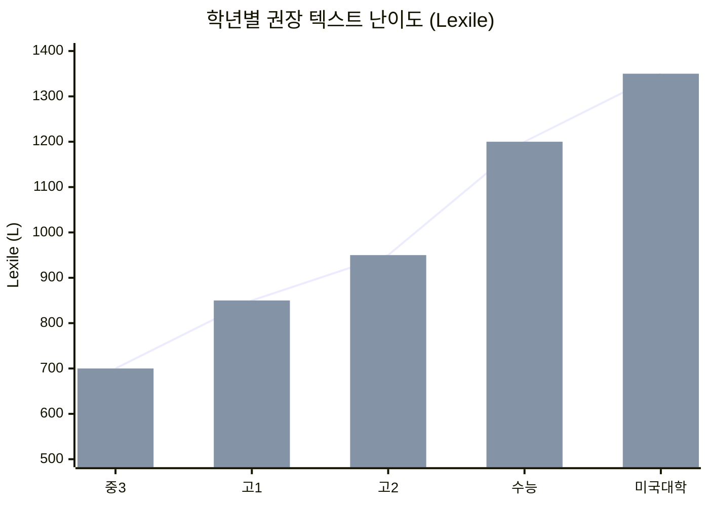
```mermaid
xychart-beta
    title "학년별 권장 텍스트 난이도 (Lexile)"
    x-axis ["중3","고1","고2","수능","미국대학"]
    y-axis "Lexile (L)" 500 --> 1400
    line [700, 850, 950, 1200, 1350]
    bar  [700, 850, 950, 1200, 1350]
```

**한 줄:** 정규 수업 주 4시간으로 200–400L를 메우는 건 *수학적으로* 불가능 → 사교육 의존이 **구조적으로** 형성됨.

---

## 1-B. 어휘 누적 곡선 — 초등 800 → 수능 6,000 word families

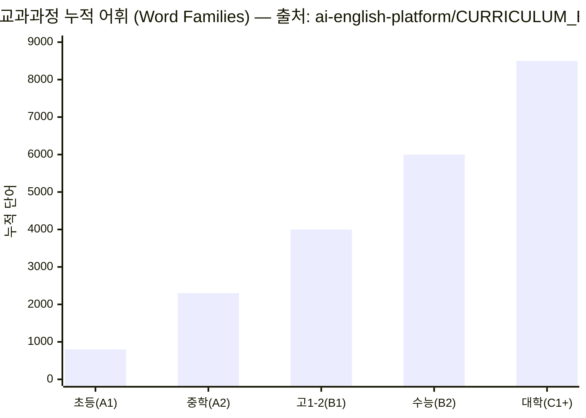
```mermaid
xychart-beta
    title "교과과정 누적 어휘 (Word Families) — 출처: ai-english-platform/CURRICULUM_BANDS"
    x-axis ["초등(A1)","중학(A2)","고1-2(B1)","수능(B2)","대학(C1+)"]
    y-axis "누적 단어" 0 --> 9000
    bar [800, 2300, 4000, 6000, 8500]
```

| 구간 | CEFR | 누적 word family | 출처 |
|---|---|---:|---|
| 초등 | A1 | 800 | `app/api/dashboard/vocab-level/route.ts` |
| 중학 | A2 | 2,300 | 同上 |
| 고1–2 | B1 | 4,000 | 同上 |
| **수능** | **B2** | **6,000** | 同上 |

---

## 1-C. 평가 비대칭 — 학교 내신 vs 수능

| 항목 | 학교 내신 | 수능 | 출처 |
|---|---|---|---|
| 문항 유형 | 어휘·문법 객관식, 본문 암기 | 추론·빈칸·함의·요약 | `lecture_v2.md` slide 9 |
| Bloom 인지 수준 | 하위 (기억·이해) | 상위 (분석·평가) | 同 |
| 시간 압박 | 낮음 | **문항당 93초** | 同 |
| D5 전략 측정 | 거의 없음 | **결정 변수** | 同 |

> **귀결:** *"학교 1등급 → 수능 3등급"* 현상은 학생의 노력 부족이 아니라 **측정 좌표계 자체가 달라서** 발생.

---

# 2 │ 학습자의 역량과 시험 문항 해결력의 괴리

> 수능 영어를 푼다는 건 **12개 micro-skill의 조합 동작**이다.
> 한 개 micro-skill의 결함이 **여러 문항 유형을 동시에 무력화**한다.
> 출처: [`csat-text-graph-maker/src/lib/logicflow/micro-skills.ts`](https://github.com/smilepat/csat-text-graph-maker/blob/main/src/lib/logicflow/micro-skills.ts)

---

## 2-A. 12 micro-skill: 1등급 목표 vs 교과과정 도달 추정


```mermaid
xychart-beta
    title "수능 1등급 목표 (GRADE1_TARGETS, 실측) vs 교과과정 도달 (추정)"
    x-axis ["A-01","A-02","A-03","A-04","B-01","B-02","B-03","B-04","C-01","C-02","C-03","C-04"]
    y-axis "마스터리 (0–100)" 0 --> 100
    bar [85,80,80,75,80,85,80,75,90,85,80,80]
    bar [65,60,55,50,50,45,40,45,55,35,40,35]
```

- **상단 막대 (실측):** `csat-text-graph-maker/src/lib/logicflow/micro-skills.ts` `GRADE1_TARGETS` 정규치
- **하단 막대 (추정):** 정성적 진단에서 역추정한 *placeholder*. production 학습자 코호트(n≥30) 형성 후 실측 교체 예정 — 트리거 조건은 [Plan §8.4](docs/01-plan/features/slides-cohort-replacement.plan.md) 참조
- **Layer 평균 갭 (추정 기준):** A −22.5 → B −35.0 → **C −42.5** (상위 인지로 갈수록 갭 단조 증가)

---

## 2-B. 1개 결함이 N개 문항 유형을 무력화한다

**B-03 "패러프레이즈 매핑"이 결함일 때 영향받는 수능 문항 유형:**

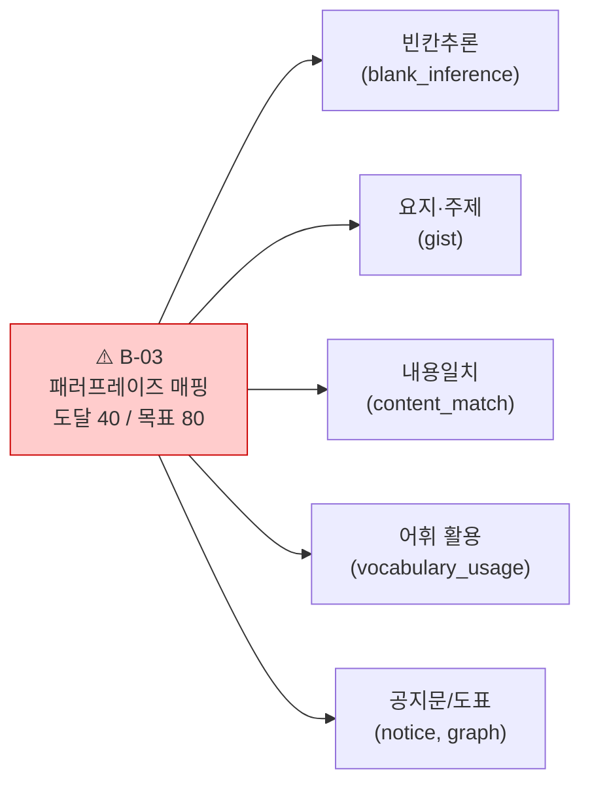
```mermaid
graph LR
    B03["⚠️ B-03<br/>패러프레이즈 매핑<br/>도달 40 / 목표 80"]
    B03 --> Q1["빈칸추론<br/>(blank_inference)"]
    B03 --> Q2["요지·주제<br/>(gist)"]
    B03 --> Q3["내용일치<br/>(content_match)"]
    B03 --> Q4["어휘 활용<br/>(vocabulary_usage)"]
    B03 --> Q5["공지문/도표<br/>(notice, graph)"]

    style B03 fill:#ffcccc,stroke:#cc0000
```

출처: `QUESTION_TYPE_SKILL_MAP` (micro-skills.ts) — 19개 수능 유형이 12개 skill의 조합.

---

## 2-C. 유형 ↔ skill 의존 매트릭스 (요약)

| 수능 유형 | Primary skill | Secondary skill |
|---|---|---|
| 빈칸추론 (blank_inference) | C-02, B-03 | A-01, B-02 |
| 어법 (grammar) | A-02, A-03 | A-04 |
| 주제·제목 | C-01 | C-03 |
| 함의 (implication) | C-02 | B-01, C-04 |
| 문장삽입 | B-02, B-01 | C-04 |
| 어휘 선택 | A-01 | B-03 |

> **시사점:** 같은 "오답 1개"라도 원인이 다르면 처방이 다르다. **분해 없이 처방 없다.**

---

# 3 │ 해결책 — 학습자의 역량 진단

> "어렵다 / 쉽다"가 아니라 **수치로 정의되는 진단**.
> 출처: [`docs/IRT_CALIBRATION_GUIDELINE.md`](https://github.com/smilepat/md-graph-db/blob/main/docs/IRT_CALIBRATION_GUIDELINE.md), 9,017 캘리브레이션 문항.

---

## 3-A. IRT 1PL Rasch — 문항·학습자를 동일 척도 위에

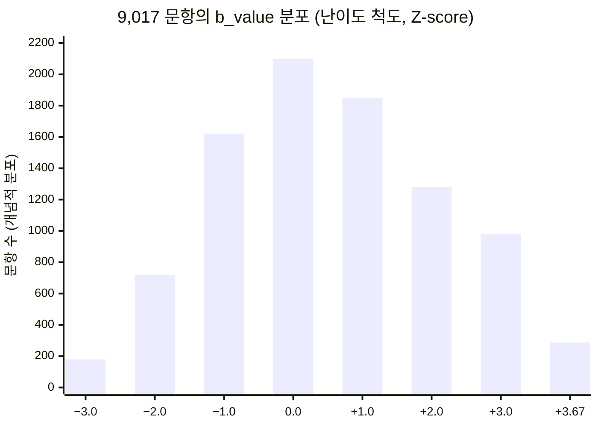
```mermaid
xychart-beta
    title "9,017 문항의 b_value 분포 (난이도 척도, Z-score)"
    x-axis ["−3.0","−2.0","−1.0","0.0","+1.0","+2.0","+3.0","+3.67"]
    y-axis "문항 수 (개념적 분포)" 0 --> 2200
    bar [180, 720, 1620, 2100, 1850, 1280, 980, 287]
```

- **b_value 범위:** −3.00 ~ +3.67 (`IRT_CALIBRATION_GUIDELINE.md`)
- **a_value:** 1.0 고정 (Cold-Start, 라쉬)
- 학습자 능력 θ도 같은 척도 → **거리 = (목표 b) − (현재 θ)** 가 그대로 계산됨

---

## 3-B. 적응형 진단 수렴 — 평균 풀이 단계 절반으로

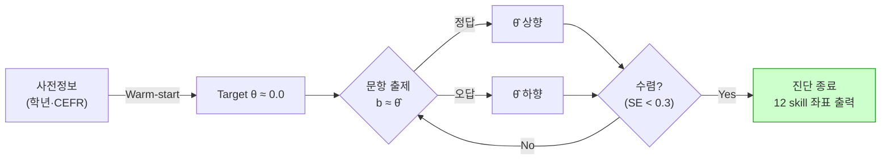
```mermaid
flowchart LR
    A["사전정보<br/>(학년·CEFR)"] -->|Warm-start| B["Target θ ≈ 0.0"]
    B --> C{"문항 출제<br/>b ≈ θ̂"}
    C -->|정답| D["θ̂ 상향"]
    C -->|오답| E["θ̂ 하향"]
    D --> F{"수렴?<br/>(SE < 0.3)"}
    E --> F
    F -->|No| C
    F -->|Yes| G["진단 종료<br/>12 skill 좌표 출력"]

    style G fill:#ccffcc,stroke:#009900
```

CAT 표준: 고정형 대비 풀이 단계 약 **50% 단축** (Wainer 2000, `logicflow-prd/PRD_RESOURCES.md`).

---

## 3-C. 4단계 마스터리 게이트 — 학습자의 현재 좌표

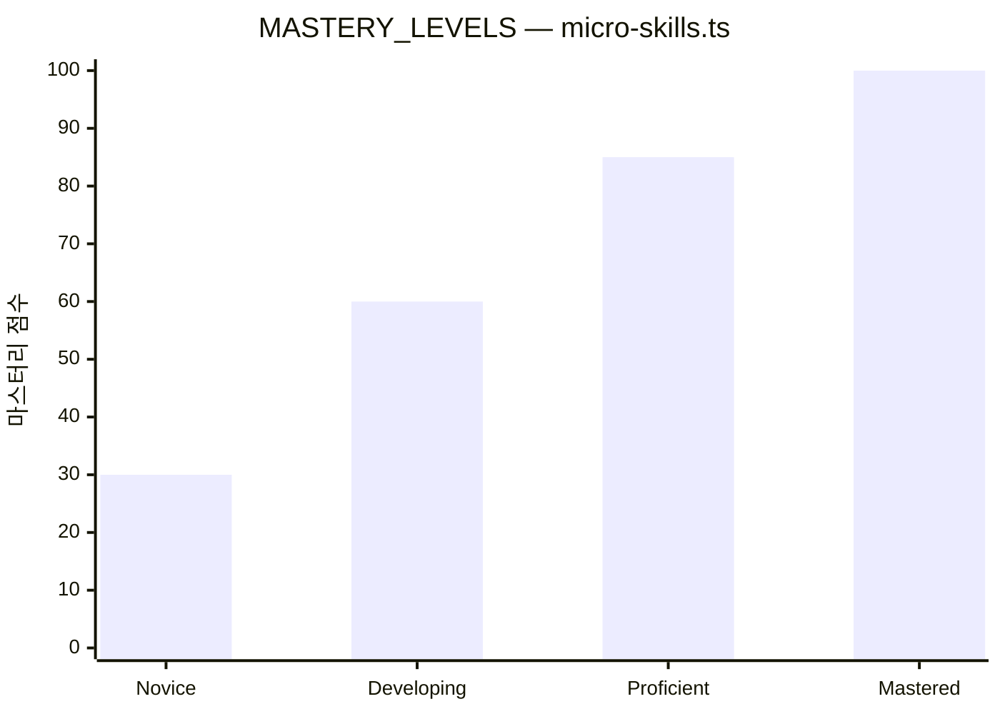
```mermaid
xychart-beta
    title "MASTERY_LEVELS — micro-skills.ts"
    x-axis ["Novice","Developing","Proficient","Mastered"]
    y-axis "마스터리 점수" 0 --> 100
    bar [30, 60, 85, 100]
```

| Level | 점수 | 라벨 | 의미 |
|---|---:|---|---|
| Novice | 0–30 | 입문 | 진단 미실시 또는 핵심 결함 |
| Developing | 31–60 | 발전 | **교과과정 도달의 평균 구간** |
| Proficient | 61–85 | 숙련 | 수능 2–3등급 영역 |
| **Mastered** | **86–100** | **마스터** | **수능 1등급 영역** |

---

# 4 │ 목표까지의 거리와 로드맵

> 12 skill 사이엔 **선수관계(prerequisites)** 가 있다 → 학습 순서가 수학적으로 결정됨.
> 출처: `micro-skills.ts` (`prerequisites` 필드) + `recommender.ts`

---

## 4-A. Skill 선수관계 DAG — 학습 경로의 골격

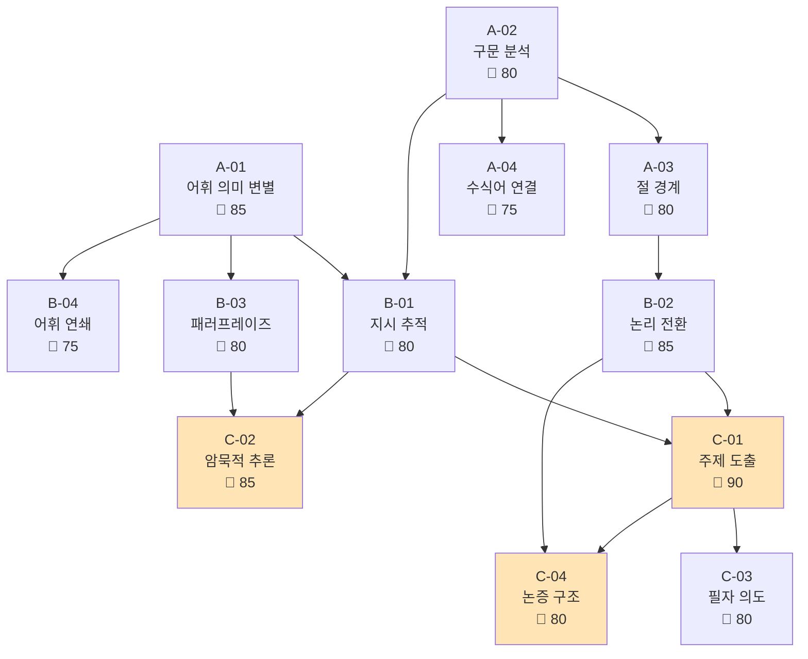
```mermaid
graph TD
    A01["A-01<br/>어휘 의미 변별<br/>🎯 85"]
    A02["A-02<br/>구문 분석<br/>🎯 80"]
    A03["A-03<br/>절 경계<br/>🎯 80"]
    A04["A-04<br/>수식어 연결<br/>🎯 75"]

    B01["B-01<br/>지시 추적<br/>🎯 80"]
    B02["B-02<br/>논리 전환<br/>🎯 85"]
    B03["B-03<br/>패러프레이즈<br/>🎯 80"]
    B04["B-04<br/>어휘 연쇄<br/>🎯 75"]

    C01["C-01<br/>주제 도출<br/>🎯 90"]
    C02["C-02<br/>암묵적 추론<br/>🎯 85"]
    C03["C-03<br/>필자 의도<br/>🎯 80"]
    C04["C-04<br/>논증 구조<br/>🎯 80"]

    A02 --> A03
    A02 --> A04
    A01 --> B01
    A02 --> B01
    A03 --> B02
    A01 --> B03
    A01 --> B04
    B01 --> C01
    B02 --> C01
    B01 --> C02
    B03 --> C02
    C01 --> C03
    B02 --> C04
    C01 --> C04

    style C01 fill:#ffe4b5
    style C02 fill:#ffe4b5
    style C04 fill:#ffe4b5
```

색칠된 노드 = **갭이 −40 이상**인 우선 보강 대상.

---

## 4-B. Recommender 알고리즘 — 우선순위 자동 결정

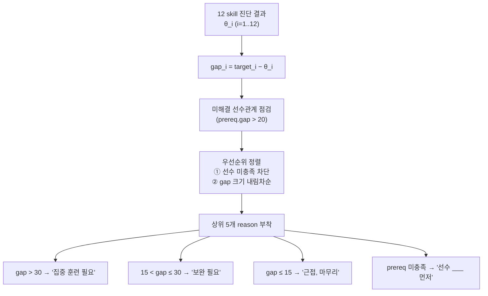
```mermaid
flowchart TD
    M["12 skill 진단 결과<br/>θ_i (i=1..12)"] --> G["gap_i = target_i − θ_i"]
    G --> P["미해결 선수관계 점검<br/>(prereq.gap > 20)"]
    P --> S["우선순위 정렬<br/>① 선수 미충족 차단<br/>② gap 크기 내림차순"]
    S --> R["상위 5개 reason 부착"]

    R --> R1["gap > 30 → '집중 훈련 필요'"]
    R --> R2["15 < gap ≤ 30 → '보완 필요'"]
    R --> R3["gap ≤ 15 → '근접, 마무리'"]
    R --> R4["prereq 미충족 → '선수 ___ 먼저'"]
```

출처: [`csat-text-graph-maker/src/lib/logicflow/recommender.ts`](https://github.com/smilepat/csat-text-graph-maker/blob/main/src/lib/logicflow/recommender.ts) `getRecommendations()`.

---

## 4-C. 학습자 예시: 추천 로드맵 (5단계)

| # | skill | 현재 → 목표 | gap | reason |
|---:|---|---:|---:|---|
| 1 | **A-02** 구문 분석 | 60 → 80 | −20 | 선수 차단(B-02·C-04 진행 불가) |
| 2 | **B-02** 논리 전환 | 45 → 85 | −40 | 집중 훈련 필요 |
| 3 | **B-03** 패러프레이즈 | 40 → 80 | −40 | 5개 유형 동시 영향 |
| 4 | **C-01** 주제 도출 | 55 → 90 | −35 | B-01·B-02 충족 후 진입 |
| 5 | **C-02** 암묵적 추론 | 35 → 85 | −50 | B-03 보강 후 단계 진입 |

> **모든 학습자에게 다른 5개** 가 출력됨 → 일괄 커리큘럼의 종언.

---

# 5 │ 계량화된 기반의 학습 경험 제공

> 진단 좌표가 정해지면, **거기에 정확히 맞는 문항을 거기서 즉시 생성**할 수 있어야 한다.
> 출처: `DATABASE_ARCHITECTURE.md` — 137,745 학습 문항 자산.

---

## 5-A. 학습 문항 자산 — 데이터 + 생성 시스템

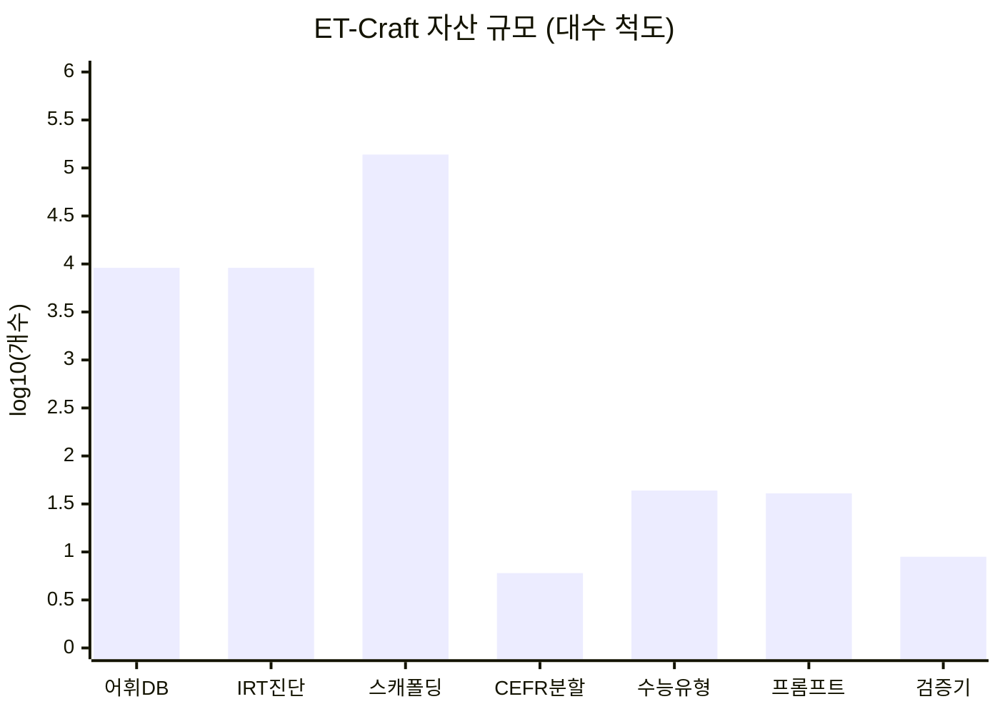
```mermaid
xychart-beta
    title "ET-Craft 자산 규모 (대수 척도)"
    x-axis ["어휘DB","IRT진단","스캐폴딩","CEFR분할","수능유형","프롬프트","검증기"]
    y-axis "log10(개수)" 0 --> 6
    bar [3.96, 3.96, 5.14, 0.78, 1.64, 1.61, 0.95]
```

| 자산 | 규모 | 비고 |
|---|---:|---|
| **마스터 어휘** | 9,183 단어 × 58 속성 | `vocab_master.sqlite` |
| **IRT 진단 문항** | 9,017 | 1PL Rasch, b ∈ [−3.00, +3.67] |
| **학습 스캐폴딩** | **137,745 문항** | 9,183 × 5D × 3 step (Gemini 2.5 Flash × 45,915 호출) |
| **CEFR 분할 패키지** | 6 | A1~C2 `learning_{Level}.json` |
| **수능 유형 풀커버리지** | **44** | LC 16 + RC 28 (`csat_itemgen` 모듈별 spec) |
| **유형별 프롬프트 라이브러리** | **41** | 224 KB, 버전·메트릭 추적 *(ET-Craft lineage, current core: EBS-demo)* |
| **모듈러 검증기** | **9** | common · grammar · gap · chart · listening · format · set 등 *(同上)* |

> 자산 차트는 자릿수 차이가 크므로 log10 척도. 핵심은 *"양"이 아니라 **구조화된 자산의 폭"*.

---

## 5-B. 난이도가 좌표로 제어됨 — `learning_step` ↔ `b_value`

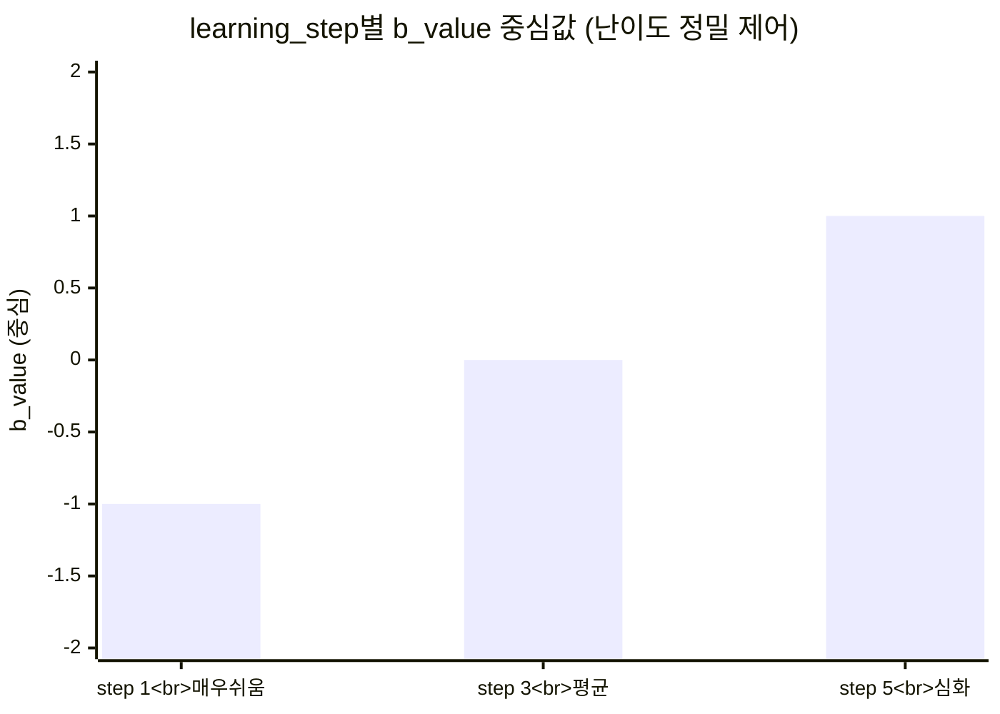
```mermaid
xychart-beta
    title "learning_step별 b_value 중심값 (난이도 정밀 제어)"
    x-axis ["step 1<br/>매우쉬움","step 3<br/>평균","step 5<br/>심화"]
    y-axis "b_value (중심)" -2.0 --> 2.0
    bar [-1.0, 0.0, 1.0]
```

| step | 의미 | b_value | 용도 |
|---:|---|---:|---|
| 1 | 매우 쉬움 | b−1.0 | 자신감 회복·기초 |
| 3 | 평균 | b±0 | 표준 학습 |
| 5 | 심화 | b+1.0 | 1등급 굳히기 |

같은 단어라도 **5D × 3step**로 15가지 학습 패턴 → "어려우면 더 쉬운 같은 단어"가 즉시 출제됨.

---

## 5-C. 2-Stage LLM × 9 검증기 × Issue Code 분기

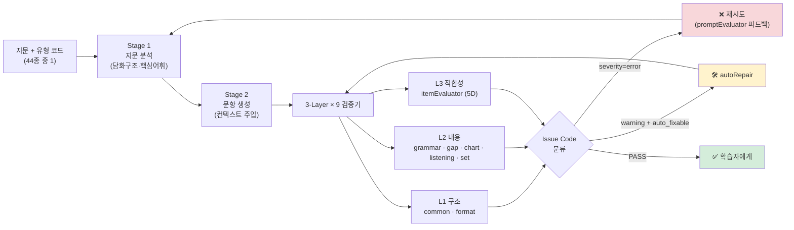
```mermaid
flowchart LR
    P["지문 + 유형 코드<br/>(44종 중 1)"] --> S1
    S1["Stage 1<br/>지문 분석<br/>(담화구조·핵심어휘)"] --> S2
    S2["Stage 2<br/>문항 생성<br/>(컨텍스트 주입)"] --> V

    V["3-Layer × 9 검증기"]
    V --> L1["L1 구조<br/>common · format"]
    V --> L2["L2 내용<br/>grammar · gap · chart · listening · set"]
    V --> L3["L3 적합성<br/>itemEvaluator (5D)"]

    L1 --> IC{"Issue Code<br/>분류"}
    L2 --> IC
    L3 --> IC
    IC -->|"severity=error"| FAIL["❌ 재시도<br/>(promptEvaluator 피드백)"]
    IC -->|"warning + auto_fixable"| FIX["🛠 autoRepair"]
    IC -->|"PASS"| OUT["✅ 학습자에게"]
    FIX --> V
    FAIL --> S1

    style OUT fill:#d4edda
    style FAIL fill:#f8d7da
    style FIX fill:#fff3cd
```

- **9 검증기 모듈** (`validator_common`, `_grammar`, `_gap`, `_chart`, `_listening`, `_format`, `_set` 등) — 유형별 전용 spec
- **3-Layer 검증** L1 구조 → L2 내용 → L3 수능 적합성
- **Issue Code 분기** 결과를 severity·auto_fixable 메타데이터로 라우팅 (`failed → 재시도` / `warning → autoRepair` / `pass → 출력`)

> 출처: ET-Craft 문항생성 계열 (`csat_itemgen` PRD, current core: `EBS-demo`).

---

## 5-D. Issue Code 분류 체계 — 검증의 메타데이터화

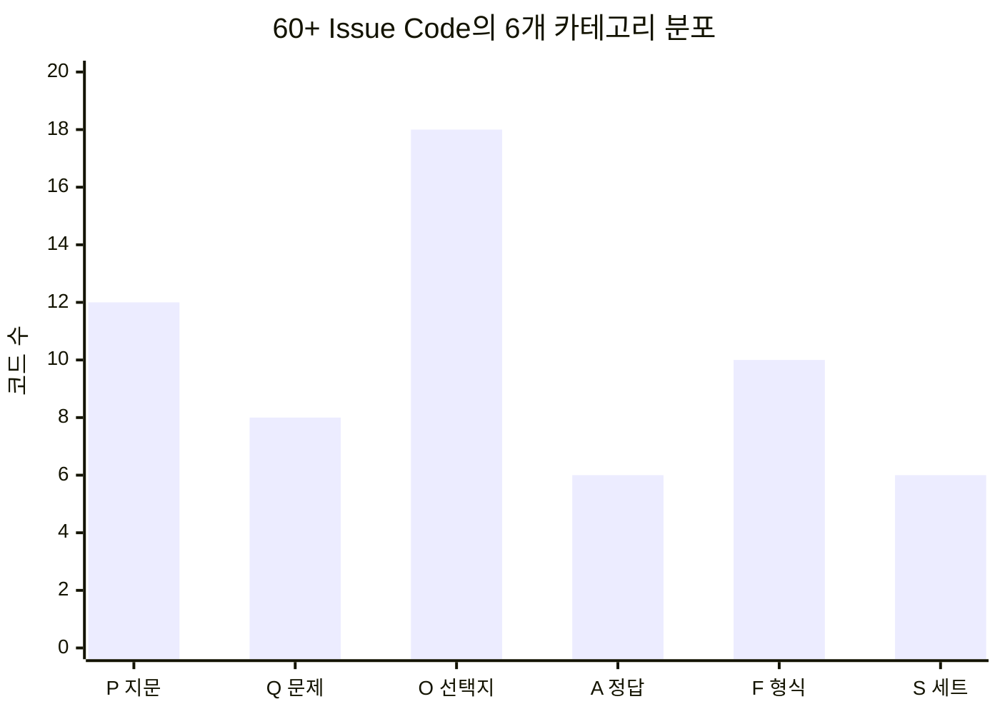
```mermaid
xychart-beta
    title "60+ Issue Code의 6개 카테고리 분포"
    x-axis ["P 지문","Q 문제","O 선택지","A 정답","F 형식","S 세트"]
    y-axis "코드 수" 0 --> 20
    bar [12, 8, 18, 6, 10, 6]
```

| 접두 | 영역 | 대표 코드 |
|---|---|---|
| **P0xx** | 지문 (Passage) | P001 너무 짧음 · P003 주제 이탈 |
| **Q0xx** | 문제 (Question) | Q001 지시문 불명확 · Q002 유형 불일치 |
| **O0xx** | 선택지 (Options) | O001 개수 오류 · **O003 매력도 낮음** · O005 복수정답 |
| **A0xx** | 정답 (Answer) | A001 정답 모호 · A002 범위 초과 |
| **F0xx** | 형식 (Format) | F001 JSON 구조 · F002 필드 누락 |
| **S0xx** | 세트 (Set) | S001 공통지문 불일치 (16-17·41-42·43-45) |

```json
{ "code": "O003", "severity": "warning", "auto_fixable": false,
  "message": "선택지 ②의 매력도가 낮음",
  "suggestion": "지문 맥락 관련 오답으로 교체",
  "location": "options[1]" }
```

> **함의:** 검증이 *분류·심각도·수정가능성* 3축으로 메타데이터화 → 자동 보정·재시도·통계 모두 가능. *"PASS/FAIL"이 아니라 **분류된 처방"*.

---

## 5-E. 문항 생성 시스템 운영 KPI

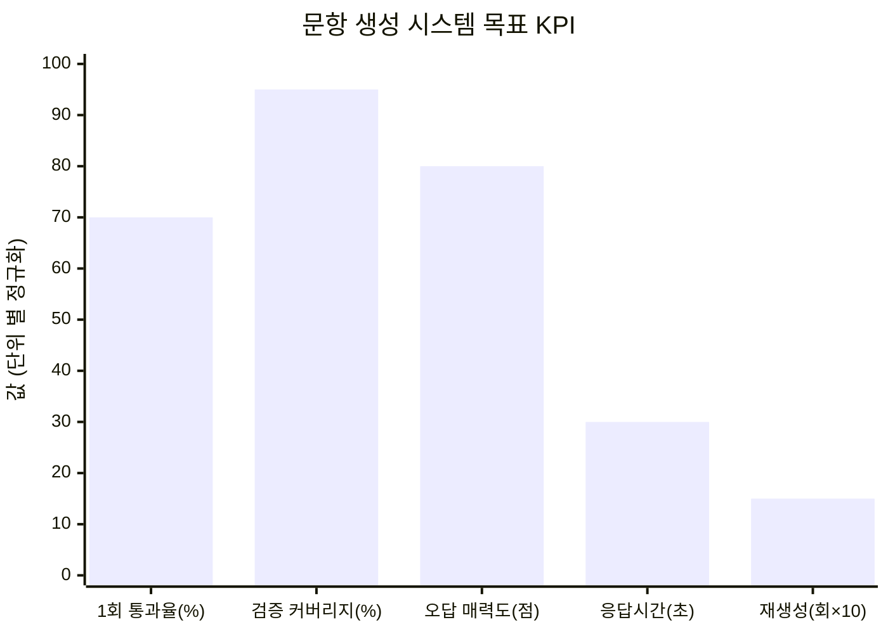
```mermaid
xychart-beta
    title "문항 생성 시스템 목표 KPI"
    x-axis ["1회 통과율(%)","검증 커버리지(%)","오답 매력도(점)","응답시간(초)","재생성(회×10)"]
    y-axis "값 (단위 별 정규화)" 0 --> 100
    bar [70, 95, 80, 30, 15]
```

| KPI | 현재 | **목표** | 측정 방법 |
|---|---:|---:|---|
| 1회 통과율 | 측정 인프라 구축 중 | **70%+** | 생성 → 검증 PASS 비율 |
| 재생성 평균 횟수 | 同 | **≤ 1.5회** | 최종 OK까지 LLM 호출 수 |
| 검증 커버리지 | ~60% (구조만) | **95%+** | spec 대비 검증 항목 비율 |
| 오답 매력도 점수 | 미측정 | **80점+** (100 만점) | `itemEvaluator` 평균 distractor 점수 |
| 단일 문항 응답 | 미측정 | **< 30초** | API 응답 시간 |

> 출처: ET-Craft lineage `PRD_IMPROVEMENT_2026.md` §2.2. **데이터 회사 포지셔닝의 정량 증거** — 콘텐츠가 아니라 *통제된 생성 시스템*.

---

# 6 │ 눈에 보이는 progress

> 진단·학습·재진단의 닫힌 루프 → **점수가 아닌 좌표의 이동**으로 성장을 본다.

---

## 6-A. Before / After — 12 skill 좌표 이동 (예시·추정)


```mermaid
xychart-beta
    title "8주 학습 후 12 micro-skill 좌표 이동 (예시 학습자 · 추정값)"
    x-axis ["A-01","A-02","A-03","A-04","B-01","B-02","B-03","B-04","C-01","C-02","C-03","C-04"]
    y-axis "마스터리 (0–100)" 0 --> 100
    bar [65,60,55,50,50,45,40,45,55,35,40,35]
    bar [78,75,72,68,72,72,68,68,75,62,65,62]
```

> ⚠️ **추정값**: 상단(Before)·하단(After) 모두 정성적 진단 기반의 예시 학습자 시나리오. 실제 production 코호트(개입 전 첫 진단 vs 8주 경과 재진단의 페어드 평균, n≥30)로 교체 예정 — 트리거 조건은 [Plan §8.4](docs/01-plan/features/slides-cohort-replacement.plan.md) 참조.

**의미 설명:** B-03 패러프레이즈 40→68 (+28)의 효과로 빈칸·요지·내용일치 유형이 일제히 상승하는 *메커니즘*은 `QUESTION_TYPE_SKILL_MAP`이 보장(실측).

---

## 6-B. 마스터리 레벨 이동 — 시각적 카운트 (예시·추정)


```mermaid
xychart-beta
    title "마스터리 레벨별 skill 수 (Before → After · 추정)"
    x-axis ["Novice","Developing","Proficient","Mastered"]
    y-axis "skill 개수" 0 --> 12
    bar [3, 9, 0, 0]
    bar [0, 4, 8, 0]
```

> ⚠️ **추정값**: 6-A와 동일한 예시 학습자 시나리오에서 파생. 실측 시 6-A 페어드 코호트의 skill별 `MASTERY_LEVELS` 카운트로 교체.

**Before:** Novice 3 / Developing 9 → **After:** Developing 4 / Proficient 8.
다음 8주: **Proficient → Mastered** 게이트 진입 → 수능 1등급 영역.

---

## 6-C. 누적 학습 시간 ↔ θ 상승 — "노력의 가시화" (예시·추정)

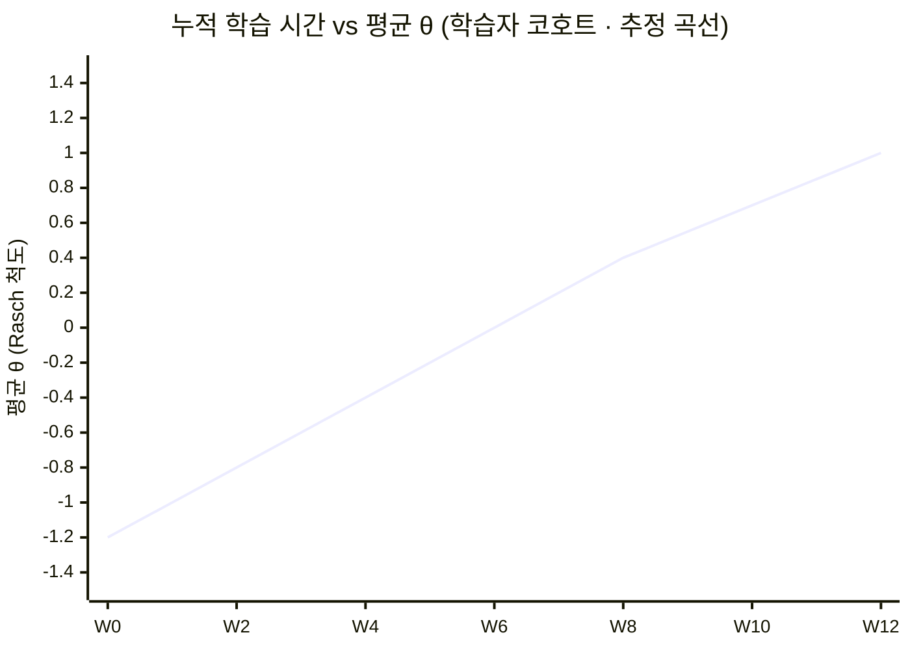
```mermaid
xychart-beta
    title "누적 학습 시간 vs 평균 θ (학습자 코호트 · 추정 곡선)"
    x-axis ["W0","W2","W4","W6","W8","W10","W12"]
    y-axis "평균 θ (Rasch 척도)" -1.5 --> 1.5
    line [-1.2, -0.8, -0.4, 0.0, 0.4, 0.7, 1.0]
```

> ⚠️ **추정 곡선**: 실측 시 production 코호트의 주별 평균 θ (Rasch 척도)로 교체. `learnerEvidence`(evidence event 로그)를 mastery-engine으로 시점별 재생하여 산출.

**핵심:** θ가 0.0(=수능 평균 난이도 정답률 50%) → +1.0(=수능 상위권)으로 직진. **좌표축은 실측**(`md-graph-db/docs/IRT_CALIBRATION_GUIDELINE.md` b 범위 −3.00~+3.67), **진행 속도는 추정**.

---

## 6-D. 진단 → 학습 → 재진단 루프

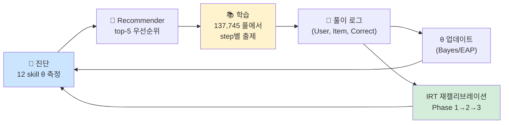
```mermaid
flowchart LR
    D["📍 진단<br/>12 skill θ 측정"] --> R["🧭 Recommender<br/>top-5 우선순위"]
    R --> L["📚 학습<br/>137,745 풀에서<br/>step별 출제"]
    L --> Q["📝 풀이 로그<br/>(User, Item, Correct)"]
    Q --> U["θ 업데이트<br/>(Bayes/EAP)"]
    U --> D

    Q --> C["IRT 재캘리브레이션<br/>Phase 1→2→3"]
    C --> D

    style D fill:#cce5ff
    style L fill:#fff3cd
    style C fill:#d4edda
```

**모트(Moat):** 풀이 로그가 쌓일수록 b·a 파라미터가 한국 학습자에 맞춰 재조정됨 → **데이터 네트워크 효과**.

---

<!-- _class: lead -->

# 한 줄 요약

> **"학습자의 거리, 좌표로 측정한다."**

| 단계 | 핵심 산출 | 근거 레포 |
|---|---|---|
| ① 갭 인식 | Lexile · 어휘 · Bloom 비대칭 | `md-graph-db/et-craft/lecture_v2.md` |
| ② 역량 분해 | 12 micro-skill × 4 mastery | `csat-text-graph-maker/.../micro-skills.ts` |
| ③ 진단 | 1PL Rasch IRT CAT | `md-graph-db/docs/IRT_CALIBRATION_GUIDELINE.md` |
| ④ 로드맵 | Prerequisite DAG + Recommender | `.../logicflow/recommender.ts` |
| ⑤ 학습 | 137,745 문항 × 2-Stage LLM | `md-graph-db/docs/DATABASE_ARCHITECTURE.md` |
| ⑥ Progress | θ 이동 + 마스터리 게이트 | 同上 + `MASTERY_LEVELS` |

---

# 부록 — 데이터 출처 (재현성)

## ✅ 실측 · 정규(canonical) 자료

- 12 micro-skill 정의·목표·선수관계 — `csat-text-graph-maker/src/lib/logicflow/micro-skills.ts` (`GRADE1_TARGETS`)
- 12-canonical 결정 (Layer A+B+C, D 제외) — `logicflow-corpus/docs/skill-mapping.md` (D2, 2026-05-17)
- 학습 자산 137,745 · 진단 9,017 · 어휘 9,183 — `md-graph-db/docs/DATABASE_ARCHITECTURE.md`
- IRT 1PL Rasch · b 범위 −3.00~+3.67 · Warm-start — `md-graph-db/docs/IRT_CALIBRATION_GUIDELINE.md`
- 교과과정 누적 어휘 800/2,300/4,000/6,000 word families — `ai-english-platform/app/api/dashboard/vocab-level/route.ts` (`CURRICULUM_BANDS`)
- Lexile 학년 표(중3 700L~수능 1200L) · Bloom 비대칭 · 93초/문항 — `md-graph-db/et-craft/lecture_v2.md`
- Recommender 우선순위·reason 로직 — `csat-text-graph-maker/src/lib/logicflow/recommender.ts`
- 2-Stage 파이프라인 · 3-Layer 검증 — `md-graph-db/et-craft/ET-Craft_Presentation.md`
- 19개 수능 유형 ↔ 12 skill 매핑 — `csat-text-graph-maker/.../micro-skills.ts` `QUESTION_TYPE_SKILL_MAP`
- `learnerMastery` / `learnerEvidence` / `diagnosticSessions` 스키마 — `csat-graphdb-318/src/lib/db/schema.ts`

## ⚠️ 추정 · 보류 자료 (실측 대기 중)

다음 슬라이드의 학습자 수치는 정성 진단에서 역추정한 **placeholder**입니다. 추정 사실은 본문 슬라이드에도 명시 라벨링되어 있습니다.

| 슬라이드 | 추정 항목 | 실측 산출 방법 (예정) |
|---|---|---|
| 2-A 하단 막대 | 12 skill 교과과정 도달치 (65/60/55/50/50/45/40/45/55/35/40/35) | 신규 가입 7일 이내 첫 진단 완료자의 skill별 평균 (`learnerMastery`, n≥30) |
| 6-A Before/After | 12 skill × 2(Before·After) = 24개 수치 | 개입 전 첫 진단 vs 56일 후 재진단의 페어드 코호트 평균 (`learnerEvidence` 시점 재생) |
| 6-B 마스터리 분포 | (3,9,0,0) → (0,4,8,0) | 6-A와 동일 코호트의 skill별 `MASTERY_LEVELS` 카운트 |
| 6-C θ 곡선 | W0–W12 7개 값 | 6-A 코호트의 주별 평균 θ (Rasch 척도, mastery-engine 재생) |

**현 상태 (2026-05-18):**

- 스키마 점검: ✅ 모든 테이블·컬럼 존재 (`csat-graphdb-318` 검증 완료)
- 데이터 점검: ❌ production 학습자 누적 0 (3개 레포 모두 demo-user / visitor=default MVP 단계)
- 재개 트리거: production 배포 후 distinct uid 30+, 또는 학원·학교 pilot 코호트 형성 시
- PDCA 추적: [docs/01-plan/features/slides-cohort-replacement.plan.md](docs/01-plan/features/slides-cohort-replacement.plan.md) §8 (Plan-B)

**투자자 Q&A 응대 가이드:** "이 수치는 추정입니다 — 다만 ① 어떤 코호트로 ② 어떤 쿼리로 교체할지 ③ 어떤 임계값(n≥30)에서 신뢰할지가 모두 Plan §8에 명시되어 있고, 동일 시스템(`learnerMastery` API)이 운영 중입니다. 데이터 회사답게 *측정 방법론을 먼저 정의*하고 있습니다."
