<!-- _class: lead -->

# 수능 영어, 거리로 보다
### 교육과정 ↔ 수능 ↔ 학습자 역량을 하나의 좌표계에 올리는 시스템

**근거 레포:** `md-graph-db` · `csat-text-graph-maker` · `ai-english-platform` · `vocabulary-db`

---

<!-- _class: layout-section -->

# 1 │ 교육과정과 수능영어수준의 격차

> *교과과정의 약속*과 *수능이 요구하는 능력* 사이에는 **수학적·구조적 갭**이 존재한다.
> 출처: [`et-craft/lecture_v2.md`](https://github.com/smilepat/md-graph-db/blob/main/et-craft/lecture_v2.md), [`docs/DATABASE_ARCHITECTURE.md`](https://github.com/smilepat/md-graph-db/blob/main/docs/DATABASE_ARCHITECTURE.md)

---

<!-- _class: layout-chart-focus -->

## 1-A. 10년 종단 Lexile — 학년별 4 cohort 분기

```echarts h=500
{
  "title": { "text": "초3→고3 Lexile 4-cohort 분기", "subtext": "Y축: Lexile (L) · 수능 지문 1,100–1,300L 영역 강조", "left": "center", "top": 8 },
  "legend": { "data": ["상위 5%", "목표 궤적 (수능 1200L)", "평균 학생", "하위 25%"], "bottom": 8, "icon": "roundRect" },
  "grid": { "left": 64, "right": 32, "top": 76, "bottom": 64, "containLabel": true },
  "xAxis": {
    "type": "category",
    "boundaryGap": false,
    "data": ["초3","초4","초5","초6","중1","중2","중3","고1","고2","고3"],
    "axisLabel": { "fontWeight": 600 }
  },
  "yAxis": {
    "type": "value",
    "name": "Lexile (L)",
    "min": 0, "max": 1300,
    "splitLine": { "lineStyle": { "color": "#e2e8f0" } }
  },
  "series": [
    {
      "name": "상위 5%", "type": "line",
      "data": [350, 450, 550, 650, 750, 850, 950, 1050, 1150, 1250],
      "smooth": true, "symbol": "circle", "symbolSize": 6,
      "lineStyle": { "width": 2.5, "color": "#1e40af" },
      "itemStyle": { "color": "#1e40af" }
    },
    {
      "name": "목표 궤적 (수능 1200L)", "type": "line",
      "data": [300, 400, 500, 600, 700, 800, 900, 1000, 1100, 1200],
      "smooth": true, "symbol": "circle", "symbolSize": 7,
      "lineStyle": { "width": 3, "color": "#2563eb" },
      "itemStyle": { "color": "#2563eb" },
      "areaStyle": { "color": "rgba(37, 99, 235, 0.12)" },
      "markArea": {
        "silent": true,
        "itemStyle": { "color": "rgba(37, 99, 235, 0.08)" },
        "label": { "show": true, "position": "insideTopRight", "color": "#1e40af", "fontSize": 11, "fontWeight": 600 },
        "data": [[
          { "yAxis": 1100, "name": "수능 지문 1,100–1,300L" },
          { "yAxis": 1300 }
        ]]
      }
    },
    {
      "name": "평균 학생", "type": "line",
      "data": [250, 320, 400, 480, 550, 620, 700, 780, 850, 950],
      "smooth": true, "symbol": "circle", "symbolSize": 6,
      "lineStyle": { "width": 2.5, "color": "#f59e0b" },
      "itemStyle": { "color": "#f59e0b" }
    },
    {
      "name": "하위 25%", "type": "line",
      "data": [150, 200, 250, 300, 350, 400, 450, 500, 550, 600],
      "smooth": true, "symbol": "circle", "symbolSize": 6,
      "lineStyle": { "width": 2.5, "color": "#ef4444" },
      "itemStyle": { "color": "#ef4444" }
    }
  ]
}
```

🟦 **목표 궤적**이 수능 1,200L 도달하나 **평균 학생은 고3에 950L**(약 250L 격차), **하위 25%는 600L**로 수능 지문 진입 불가.

- **MetaMetrics 2023:** *"43% of Korean 12th graders were reading below 1000L"* (수능 지문 도달 불가)
- **수능 지문:** 1,100–1,300L · **고3 평균:** ~950L → **고3 1년 동안 250–350L 격차** 잔존
- 학년 진행에 따라 cohort 간 격차가 **단조 증가** → 일괄 커리큘럼은 cohort 분기를 메우지 못함

> 출처: [`Korea_English_Solution/components/learning-trajectory.tsx`](https://github.com/smilepat/Korea_English_Solution/blob/main/components/learning-trajectory.tsx) + MetaMetrics 2023 Annual Reading Report for Korea.

---

<!-- _class: layout-2col -->

## 1-D. 한국 vs 미국 — 읽기 노출량 **약 44배 격차**


```mermaid
xychart-beta
    title "초3→고3 누적 영어 읽기 노출량 (만 단어)"
    x-axis ["초등(3-6)","중학(7-9)","고등(10-12)","합계(3-12)"]
    y-axis "누적 단어 (만)" 0 --> 1000
    bar [3.6, 6.75, 9, 19.3]
    bar [150, 225, 600, 975]
```

상단 = 한국 학생 / 하단 = 미국 학생 (단위: 만 단어)

| 학교급 | 한국 | 미국 | 격차 배율 |
|---|---:|---:|---:|
| 초등 (3–6) | 32K–40K | 1.5M | **약 40배** |
| 중학 (7–9) | 60K–75K | 2.25M | **약 33배** |
| 고등 (10–12) | 75K–105K | 6.0M | **약 66배** |
| **합계** | **167K–220K** | **9.75M** | **약 44배** |

> 한국 학생은 미국 학생 대비 **1/44 수준의 영어 텍스트**에만 노출. 교과서 중심·제한된 읽기 환경의 구조적 귀결.
> 출처: `Korea_English_Solution/EDUCATION_ANALYSIS.md` §1.1.

---

<!-- _class: layout-chart-focus -->

## 1-E. 수업시간 부족 — CEFR B1 도달이 **수학적으로 불가능**

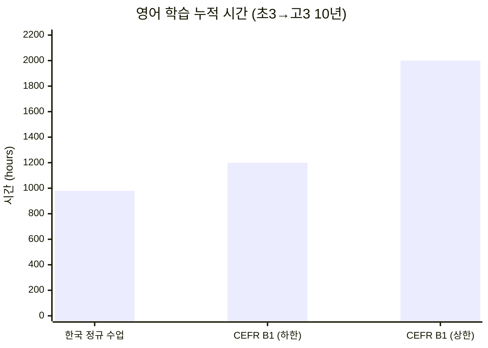
```mermaid
xychart-beta
    title "영어 학습 누적 시간 (초3→고3 10년)"
    x-axis ["한국 정규 수업","CEFR B1 (하한)","CEFR B1 (상한)"]
    y-axis "시간 (hours)" 0 --> 2200
    bar [980, 1200, 2000]
```

| 항목 | 시간 |
|---|---:|
| 한국 정규 영어 수업 누적 (초3–고3, 10년) | **980시간** |
| CEFR B1 (중급 하) 달성 최소 필요 | 1,200시간 |
| CEFR B1 (중급 하) 달성 권장 | 2,000시간 |
| **부족분** | **220–1,020시간 (22–51%)** |

> 현재 교육과정 시수만으로는 **CEFR B1조차 구조적으로 도달 불가**. 사교육 의존도가 *경제적 선택*이 아니라 *수학적 필연*이 되는 이유.
> 출처: `Korea_English_Solution/EDUCATION_ANALYSIS.md` §1.2.

---

<!-- _class: layout-chart-focus -->

## 1-F. 격차율 누진 — 학년 진행에 따라 **단조 증가**

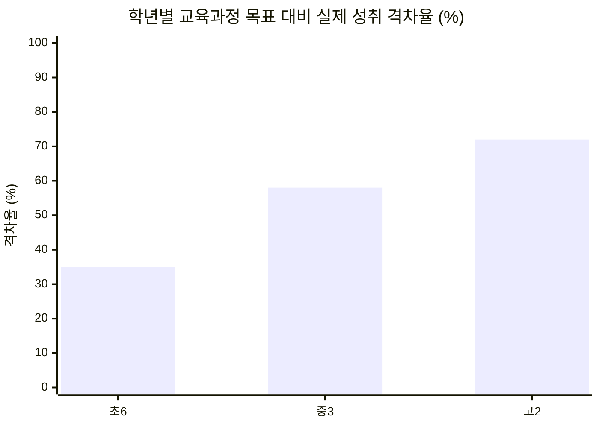
```mermaid
xychart-beta
    title "학년별 교육과정 목표 대비 실제 성취 격차율 (%)"
    x-axis ["초6","중3","고2"]
    y-axis "격차율 (%)" 0 --> 100
    bar [35, 58, 72]
```

| 학년 | 격차율 | 주요 결손 영역 |
|---|---:|---|
| 초6 | 35% | 기본 구문 이해 |
| 중3 | 58% | 복합문 분석 |
| 고2 | **72%** | 추론적 독해 |

> 격차는 학년이 올라갈수록 **더 빨리 커진다** → **고2에서 메꿀 수 없음**. 조기 진단·개인화의 정량 근거.
> 출처: `Korea_English_Solution/components/charts.tsx` (GEPS 2017–2022, CSAT 텍스트 분석, 2023 수능 33번 분석).

---

<!-- _class: layout-chart-focus -->

## 1-G. 교육과정 vs CEFR — **학년별 도달 갭** 매트릭스

```echarts h=480
{
  "title": { "text": "한국 교육과정 목표 CEFR vs 실제 도달 (학년별)", "subtext": "1=A1 · 2=A2 · 3=B1 · 4=B2", "left": "center", "top": 8 },
  "legend": { "data": ["목표 CEFR", "실제 도달"], "bottom": 8 },
  "grid": { "left": 60, "right": 32, "top": 70, "bottom": 60, "containLabel": true },
  "xAxis": {
    "type": "category",
    "boundaryGap": false,
    "data": ["초3-4","초5-6","중1","중2-3","고1","고2-3"],
    "axisLabel": { "fontWeight": 600 }
  },
  "yAxis": {
    "type": "value",
    "name": "CEFR 단계",
    "min": 0, "max": 4,
    "interval": 1,
    "axisLabel": {
      "formatter": "{value}"
    }
  },
  "series": [
    {
      "name": "목표 CEFR", "type": "line",
      "data": [1.0, 1.5, 2.0, 2.5, 3.0, 3.5],
      "smooth": true, "symbol": "circle", "symbolSize": 9,
      "lineStyle": { "width": 3, "color": "#2563eb" },
      "itemStyle": { "color": "#2563eb" },
      "areaStyle": { "color": "rgba(37, 99, 235, 0.10)" }
    },
    {
      "name": "실제 도달", "type": "line",
      "data": [0.8, 1.0, 1.5, 2.0, 2.0, 2.5],
      "smooth": true, "symbol": "circle", "symbolSize": 9,
      "lineStyle": { "width": 3, "color": "#ef4444" },
      "itemStyle": { "color": "#ef4444" },
      "areaStyle": { "color": "rgba(239, 68, 68, 0.10)" },
      "markArea": {
        "silent": true,
        "itemStyle": { "color": "rgba(239, 68, 68, 0.06)" },
        "data": [[{ "xAxis": "고2-3" }, { "xAxis": "고2-3" }]]
      }
    }
  ]
}
```

목표 vs 실제 — 모든 학년에서 **목표 미달** + 고2–3에서 **격차 최대 1단계**.

| 학교급 | 학년 | 한국 목표 | CEFR | **실제 도달 (다수)** |
|---|---|---|---|---|
| 초등 | 3-4 | 기초 의사소통 | **A1** | A1 미만 ⚠️ |
| 초등 | 5-6 | 친숙 주제 듣/말 | A1~A2 | A1 |
| 중학 | 1 | 일상 듣/읽 이해 | A2 | A1~A2 |
| 중학 | 2-3 | 친숙 주제 말/쓰기 | A2~B1 | A2 |
| 고등 | 1 | 복합 이해·표현 | **B1** | A2~B1 |
| 고등 | 2-3 | 추상 주제 해석 | **B1~B2** | **B1 미만 ⚠️** |

> 모든 학년에서 *지속적 갭* — 누적 효과로 고2–3에서 **B1 미만** 다수.
> 출처: `Korea_English_Solution/EDUCATION_ANALYSIS.md` §1.3.

---

<!-- _class: layout-chart-focus -->

## 1-B. 어휘 누적 곡선 — 초등 800 → 수능 6,000 word families

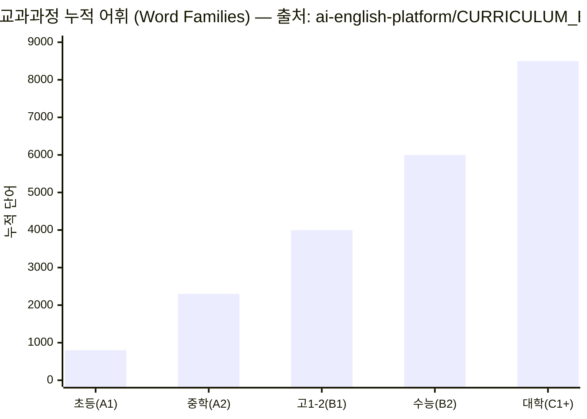
```mermaid
xychart-beta
    title "교과과정 누적 어휘 (Word Families) — 출처: ai-english-platform/CURRICULUM_BANDS"
    x-axis ["초등(A1)","중학(A2)","고1-2(B1)","수능(B2)","대학(C1+)"]
    y-axis "누적 단어" 0 --> 9000
    bar [800, 2300, 4000, 6000, 8500]
```

| 구간 | CEFR | 누적 word family | 출처 |
|---|---|---:|---|
| 초등 | A1 | 800 | `app/api/dashboard/vocab-level/route.ts` |
| 중학 | A2 | 2,300 | 同上 |
| 고1–2 | B1 | 4,000 | 同上 |
| **수능** | **B2** | **6,000** | 同上 |

---

<!-- _class: layout-2col -->

## 1-C. 평가 비대칭 — 학교 내신 vs 수능 (4축 비교)


```mermaid
xychart-beta
    title "4축 평가 비대칭 (0–10 정규화 · 높을수록 강도 높음)"
    x-axis ["문항복잡도","Bloom 인지수준","시간 압박","D5 전략 측정"]
    y-axis "강도 (0–10)" 0 --> 10
    bar [3, 3, 2, 1]
    bar [9, 9, 9, 8]
```

상단 = **학교 내신** / 하단 = **수능** (높을수록 강도 높음)

| 항목 | 학교 내신 | 수능 | 출처 |
|---|---|---|---|
| 문항 유형 | 어휘·문법 객관식, 본문 암기 | 추론·빈칸·함의·요약 | `lecture_v2.md` slide 9 |
| Bloom 인지 수준 | 하위 (기억·이해) | 상위 (분석·평가) | 同 |
| 시간 압박 | 낮음 | **문항당 93초** | 同 |
| D5 전략 측정 | 거의 없음 | **결정 변수** | 同 |

> **귀결:** *"학교 1등급 → 수능 3등급"* 현상은 학생의 노력 부족이 아니라 **측정 좌표계 자체가 달라서** 발생. 4축 모두에서 수능이 *극단적으로* 우측 이동.

---

<!-- _class: layout-section -->

# 2 │ 학습자의 역량과 시험 문항 해결력의 괴리

> 수능 영어를 푼다는 건 **12개 micro-skill의 조합 동작**이다.
> 한 개 micro-skill의 결함이 **여러 문항 유형을 동시에 무력화**한다.
> 출처: [`csat-text-graph-maker/src/lib/logicflow/micro-skills.ts`](https://github.com/smilepat/csat-text-graph-maker/blob/main/src/lib/logicflow/micro-skills.ts)

---

<!-- _class: layout-chart-focus -->

## 2-A. 12 micro-skill: 1등급 목표 vs 교과과정 도달 추정

```echarts h=500
{
  "title": { "text": "수능 1등급 목표 (실측) vs 교과과정 도달 (추정)", "left": "center", "top": 8 },
  "legend": { "data": ["1등급 목표", "교과과정 도달 (추정)"], "bottom": 8 },
  "grid": { "left": 56, "right": 32, "top": 56, "bottom": 60, "containLabel": true },
  "xAxis": {
    "type": "category",
    "data": ["A-01","A-02","A-03","A-04","B-01","B-02","B-03","B-04","C-01","C-02","C-03","C-04"],
    "axisLabel": { "fontWeight": 600 }
  },
  "yAxis": { "type": "value", "name": "마스터리 (0–100)", "max": 100, "min": 0, "nameGap": 18 },
  "series": [
    {
      "name": "1등급 목표", "type": "bar",
      "data": [85,80,80,75,80,85,80,75,90,85,80,80],
      "itemStyle": { "color": "#2563eb", "borderRadius": [4,4,0,0] },
      "barGap": "10%"
    },
    {
      "name": "교과과정 도달 (추정)", "type": "bar",
      "data": [65,60,55,50,50,45,40,45,55,35,40,35],
      "itemStyle": { "color": "#f59e0b", "borderRadius": [4,4,0,0] }
    }
  ]
}
```

- **파란 막대 (실측):** `csat-text-graph-maker/src/lib/logicflow/micro-skills.ts` `GRADE1_TARGETS` 정규치
- **하단 막대 (추정):** 정성적 진단에서 역추정한 *placeholder*. production 학습자 코호트(n≥30) 형성 후 실측 교체 예정 — 트리거 조건은 [Plan §8.4](docs/01-plan/features/slides-cohort-replacement.plan.md) 참조
- **Layer 평균 갭 (추정 기준):** A −22.5 → B −35.0 → **C −42.5** (상위 인지로 갈수록 갭 단조 증가)

---

<!-- _class: layout-chart-focus -->

## 2-B. 1개 결함이 N개 문항 유형을 무력화한다

**B-03 "패러프레이즈 매핑"이 결함일 때 영향받는 수능 문항 유형:**

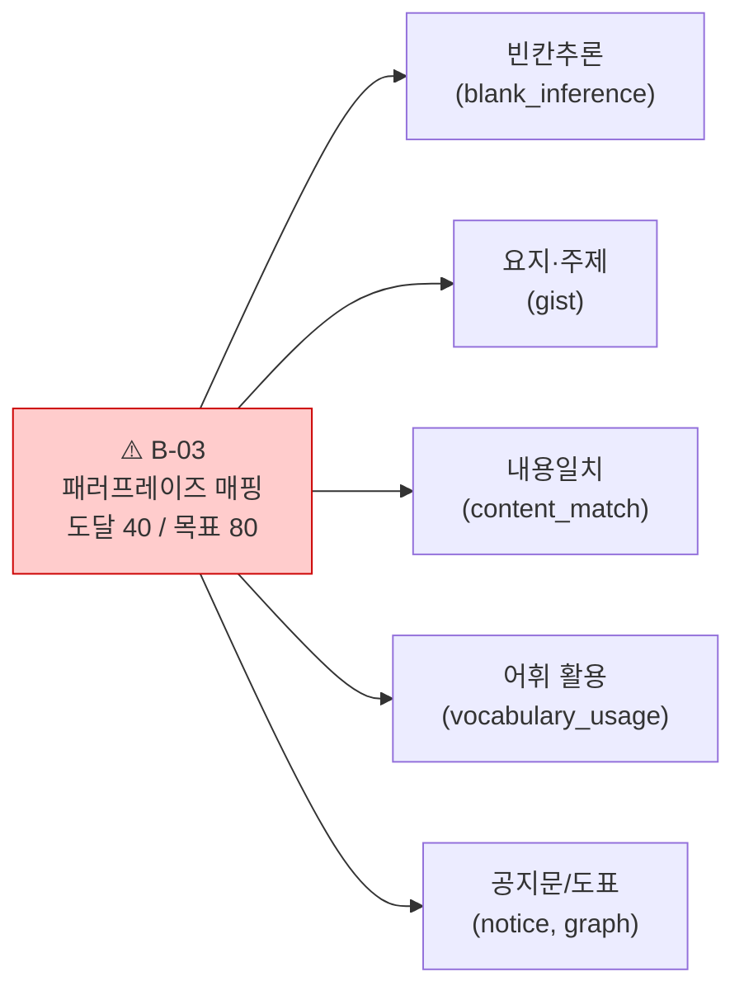
```mermaid
graph LR
    B03["⚠️ B-03<br/>패러프레이즈 매핑<br/>도달 40 / 목표 80"]
    B03 --> Q1["빈칸추론<br/>(blank_inference)"]
    B03 --> Q2["요지·주제<br/>(gist)"]
    B03 --> Q3["내용일치<br/>(content_match)"]
    B03 --> Q4["어휘 활용<br/>(vocabulary_usage)"]
    B03 --> Q5["공지문/도표<br/>(notice, graph)"]

    style B03 fill:#ffcccc,stroke:#cc0000
```

출처: `QUESTION_TYPE_SKILL_MAP` (micro-skills.ts) — 19개 수능 유형이 12개 skill의 조합.

---

<!-- _class: layout-2col -->

## 2-C. Skill 영향력 — 어느 skill이 가장 많은 유형을 좌우하나


```mermaid
xychart-beta
    title "19개 수능 유형 중 해당 skill이 Primary로 쓰이는 횟수"
    x-axis ["A-01","A-02","A-03","A-04","B-01","B-02","B-03","B-04","C-01","C-02","C-03","C-04"]
    y-axis "유형 수 (0–7)" 0 --> 7
    bar [3,1,1,0,5,3,5,1,6,3,3,1]
    bar [3,0,0,1,3,4,2,1,1,0,1,2]
```

**상단(Primary) + 하단(Secondary)** = 해당 skill에 영향받는 총 유형 수. 출처: `QUESTION_TYPE_SKILL_MAP` 19개 유형 × 12 skill 전수 집계.

| 영향력 순위 | skill | Primary 유형 수 | Total (P+S) | 시사점 |
|---:|---|---:|---:|---|
| 🥇 | **B-01** 지시 추적 | 5 | **8 / 19** | 응집성 핵심 — 보강 효율 최대 |
| 🥈 | **C-01** 주제 도출 | **6** | 7 / 19 | Primary 단독 최다 — 1등급 게이트 |
| 🥈 | **B-03** 패러프레이즈 | 5 | 7 / 19 | 5개 유형 일제히 무력화 가능 |
| 🥈 | **B-02** 논리 전환 | 3 | 7 / 19 | 흐름 이해의 허브 |
| ⬇️ | A-04 수식어 / B-04 어휘연쇄 | 0–1 | 1–2 / 19 | leverage 낮음 — 후순위 가능 |

> **시사점:** 12개 skill이 동등하지 않다. **B-01·C-01·B-03 3개만 보강해도 19개 중 13개 유형이 영향권**에 들어옴 → 추천 알고리즘의 우선순위 가중치 기반.

---

<!-- _class: layout-chart-focus -->

## 2-D. 19 수능 유형 ↔ 12 skill 풀 매핑 그래프

```echarts w=960 h=560
{
  "title": { "text": "19 수능 유형 → 12 micro-skill 매핑 (Sankey)", "left": "center", "top": 6 },
  "tooltip": { "trigger": "item", "triggerOn": "mousemove" },
  "series": [{
    "type": "sankey",
    "left": 24, "right": 24, "top": 44, "bottom": 12,
    "nodeWidth": 18, "nodeGap": 8,
    "lineStyle": { "color": "gradient", "curveness": 0.5 },
    "label": { "fontFamily": "'Pretendard Variable', sans-serif", "fontSize": 12, "fontWeight": 600, "color": "#0f172a" },
    "emphasis": { "focus": "adjacency" },
    "nodes": [
      { "name": "빈칸추론",   "itemStyle": { "color": "#0ea5e9" } },
      { "name": "순서배열",   "itemStyle": { "color": "#0ea5e9" } },
      { "name": "문장삽입",   "itemStyle": { "color": "#0ea5e9" } },
      { "name": "무관문장",   "itemStyle": { "color": "#0ea5e9" } },
      { "name": "주제·제목",  "itemStyle": { "color": "#0ea5e9" } },
      { "name": "요지·요약",  "itemStyle": { "color": "#0ea5e9" } },
      { "name": "함의추론",   "itemStyle": { "color": "#0ea5e9" } },
      { "name": "어법",       "itemStyle": { "color": "#ca8a04" } },
      { "name": "어휘선택",   "itemStyle": { "color": "#16a34a" } },
      { "name": "내용일치",   "itemStyle": { "color": "#0ea5e9" } },
      { "name": "장문",       "itemStyle": { "color": "#0ea5e9" } },
      { "name": "기타",       "itemStyle": { "color": "#9333ea" } },

      { "name": "A-01 어휘",            "itemStyle": { "color": "#eab308" } },
      { "name": "A-02 구문",            "itemStyle": { "color": "#eab308" } },
      { "name": "A-03 절경계",          "itemStyle": { "color": "#eab308" } },
      { "name": "B-01 지시추적 ★",      "itemStyle": { "color": "#1e40af" } },
      { "name": "B-02 논리전환 ★",      "itemStyle": { "color": "#1e40af" } },
      { "name": "B-03 패러프레이즈 ★",  "itemStyle": { "color": "#1e40af" } },
      { "name": "B-04 어휘연쇄",        "itemStyle": { "color": "#3b82f6" } },
      { "name": "C-01 주제도출 ★",      "itemStyle": { "color": "#9d174d" } },
      { "name": "C-02 암묵추론",        "itemStyle": { "color": "#ec4899" } },
      { "name": "C-03 필자의도",        "itemStyle": { "color": "#ec4899" } },
      { "name": "C-04 논증구조",        "itemStyle": { "color": "#ec4899" } }
    ],
    "links": [
      { "source": "빈칸추론",  "target": "C-02 암묵추론",        "value": 2 },
      { "source": "빈칸추론",  "target": "B-03 패러프레이즈 ★",  "value": 2 },
      { "source": "순서배열",  "target": "B-02 논리전환 ★",      "value": 2 },
      { "source": "순서배열",  "target": "B-04 어휘연쇄",        "value": 2 },
      { "source": "문장삽입",  "target": "B-02 논리전환 ★",      "value": 2 },
      { "source": "문장삽입",  "target": "B-01 지시추적 ★",      "value": 2 },
      { "source": "무관문장",  "target": "C-01 주제도출 ★",      "value": 2 },
      { "source": "무관문장",  "target": "B-02 논리전환 ★",      "value": 2 },
      { "source": "주제·제목", "target": "C-01 주제도출 ★",      "value": 2 },
      { "source": "요지·요약", "target": "C-01 주제도출 ★",      "value": 2 },
      { "source": "요지·요약", "target": "C-03 필자의도",        "value": 2 },
      { "source": "함의추론",  "target": "C-02 암묵추론",        "value": 2 },
      { "source": "어법",      "target": "A-02 구문",            "value": 2 },
      { "source": "어법",      "target": "A-03 절경계",          "value": 2 },
      { "source": "어휘선택",  "target": "A-01 어휘",            "value": 2 },
      { "source": "내용일치",  "target": "B-03 패러프레이즈 ★",  "value": 2 },
      { "source": "내용일치",  "target": "B-01 지시추적 ★",      "value": 2 },
      { "source": "장문",      "target": "C-01 주제도출 ★",      "value": 2 },
      { "source": "장문",      "target": "C-02 암묵추론",        "value": 2 },
      { "source": "기타",      "target": "C-03 필자의도",        "value": 1, "lineStyle": { "opacity": 0.35 } },
      { "source": "기타",      "target": "A-01 어휘",            "value": 1, "lineStyle": { "opacity": 0.35 } }
    ]
  }]
}
```

좌(19 수능 유형) → 우(12 micro-skill). 흐름의 두께 = Primary(굵음) vs Secondary(반투명). **★ skill** 4개(B-01·B-02·B-03·C-01)가 가장 많은 유형을 수렴.

> 출처: `csat-text-graph-maker/.../micro-skills.ts` `QUESTION_TYPE_SKILL_MAP` 전수.

---

<!-- _class: layout-chart-focus -->

## 2-E. Performance Descriptor 5축 — 목표 vs 고2 실측

```echarts h=520
{
  "title": { "text": "한국교육과정평가원 Performance Descriptor 5축 — 목표 vs 고2 실측", "left": "center", "top": 8 },
  "legend": { "data": ["목표", "고2 실측"], "bottom": 8 },
  "radar": {
    "indicator": [
      { "name": "문법 정확성", "max": 100 },
      { "name": "어휘 다양성", "max": 100 },
      { "name": "논리 구성력", "max": 100 },
      { "name": "창의성",     "max": 100 },
      { "name": "맥락 적절성", "max": 100 }
    ],
    "radius": "62%",
    "center": ["50%", "54%"]
  },
  "series": [{
    "type": "radar",
    "data": [
      { "name": "목표",     "value": [80, 75, 70, 65, 75], "areaStyle": { "color": "rgba(37, 99, 235, 0.18)" }, "lineStyle": { "width": 2 }, "symbolSize": 6 },
      { "name": "고2 실측", "value": [35, 25, 20, 15, 5],  "areaStyle": { "color": "rgba(239, 68, 68, 0.20)" }, "lineStyle": { "width": 2 }, "symbolSize": 6 }
    ]
  }]
}
```

5축 모두에서 **목표의 ½ 미만**. 특히 **맥락 적절성 5점**(목표 75)으로 **D5 전략 차원의 사각지대**가 외부 출처에서도 확인됨.

| 축 | 목표 | 고2 실측 | 갭 |
|---|---:|---:|---:|
| 문법 정확성 | 80 | 35 | −45 |
| 어휘 다양성 | 75 | 25 | −50 |
| 논리 구성력 | 70 | 20 | −50 |
| 창의성 | 65 | 15 | −50 |
| **맥락 적절성** | 75 | **5** | **−70** |

> 12 micro-skill 갭(슬라이드 2-A)과 **독립 출처에서 일관**된 결론.
> 출처: `Korea_English_Solution/components/charts.tsx::RadarChart`, 한국교육과정평가원 Performance Descriptor.

---

<!-- _class: layout-chart-focus -->

## 2-F. 학습 결손 영역 — 어디서 가장 자주 막히나

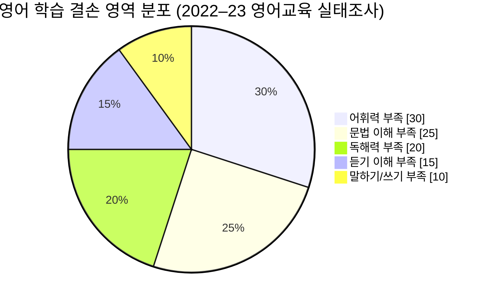
```mermaid
pie showData
    title 영어 학습 결손 영역 분포 (2022–23 영어교육 실태조사)
    "어휘력 부족" : 30
    "문법 이해 부족" : 25
    "독해력 부족" : 20
    "듣기 이해 부족" : 15
    "말하기/쓰기 부족" : 10
```

> **합계 어휘+문법+독해 = 75%** — 12 micro-skill 중 Layer A·B(어휘·구문·응집성)와 직접 대응. 음성·생산 영역은 시험 비중이 낮아 후순위.
> 출처: `Korea_English_Solution/components/charts.tsx::PieChart`, 2022–2023 영어교육 실태조사.

---

<!-- _class: layout-section -->

# 3 │ 해결책 — 학습자의 역량 진단

> "어렵다 / 쉽다"가 아니라 **수치로 정의되는 진단**.
> 출처: [`docs/IRT_CALIBRATION_GUIDELINE.md`](https://github.com/smilepat/md-graph-db/blob/main/docs/IRT_CALIBRATION_GUIDELINE.md), 9,017 캘리브레이션 문항.

---

<!-- _class: layout-chart-focus -->

## 3-A. IRT 1PL Rasch — 문항·학습자를 동일 척도 위에

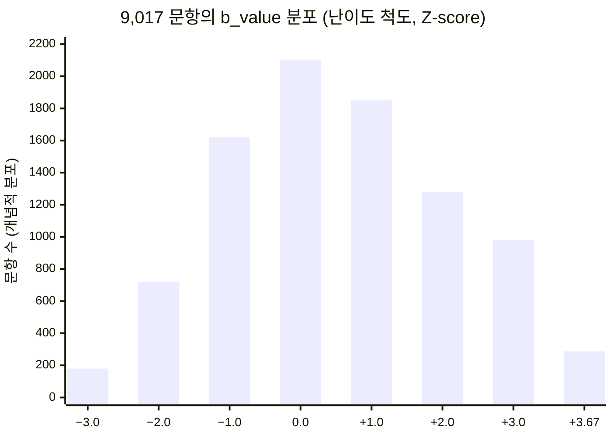
```mermaid
xychart-beta
    title "9,017 문항의 b_value 분포 (난이도 척도, Z-score)"
    x-axis ["−3.0","−2.0","−1.0","0.0","+1.0","+2.0","+3.0","+3.67"]
    y-axis "문항 수 (개념적 분포)" 0 --> 2200
    bar [180, 720, 1620, 2100, 1850, 1280, 980, 287]
```

- **b_value 범위:** −3.00 ~ +3.67 (`IRT_CALIBRATION_GUIDELINE.md`)
- **a_value:** 1.0 고정 (Cold-Start, 라쉬)
- 학습자 능력 θ도 같은 척도 → **거리 = (목표 b) − (현재 θ)** 가 그대로 계산됨

---

<!-- _class: layout-chart-focus -->

## 3-B. 적응형 진단 수렴 — 평균 풀이 단계 절반으로

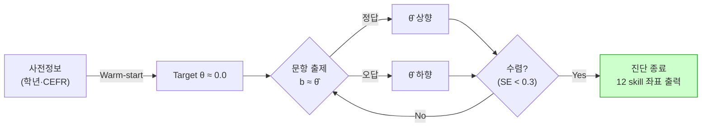
```mermaid
flowchart LR
    A["사전정보<br/>(학년·CEFR)"] -->|Warm-start| B["Target θ ≈ 0.0"]
    B --> C{"문항 출제<br/>b ≈ θ̂"}
    C -->|정답| D["θ̂ 상향"]
    C -->|오답| E["θ̂ 하향"]
    D --> F{"수렴?<br/>(SE < 0.3)"}
    E --> F
    F -->|No| C
    F -->|Yes| G["진단 종료<br/>12 skill 좌표 출력"]

    style G fill:#ccffcc,stroke:#009900
```

CAT 표준: 고정형 대비 풀이 단계 약 **50% 단축** (Wainer 2000, `logicflow-prd/PRD_RESOURCES.md`).

---

<!-- _class: layout-2col -->

## 3-C. 4단계 마스터리 게이트 — 학습자의 현재 좌표

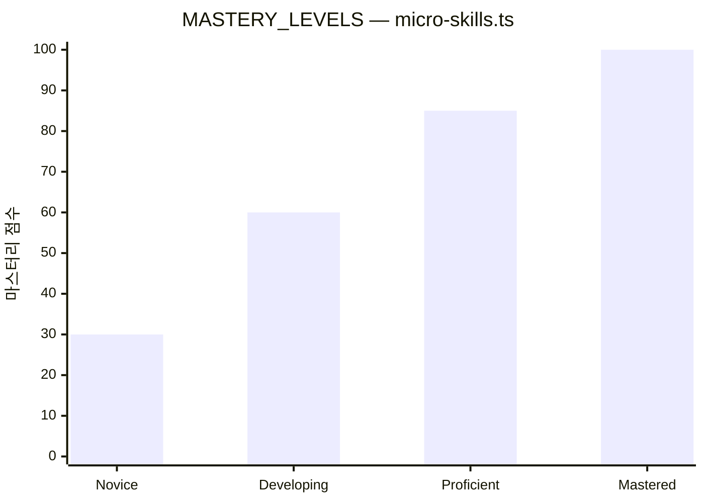
```mermaid
xychart-beta
    title "MASTERY_LEVELS — micro-skills.ts"
    x-axis ["Novice","Developing","Proficient","Mastered"]
    y-axis "마스터리 점수" 0 --> 100
    bar [30, 60, 85, 100]
```

| Level | 점수 | 라벨 | 의미 |
|---|---:|---|---|
| Novice | 0–30 | 입문 | 진단 미실시 또는 핵심 결함 |
| Developing | 31–60 | 발전 | **교과과정 도달의 평균 구간** |
| Proficient | 61–85 | 숙련 | 수능 2–3등급 영역 |
| **Mastered** | **86–100** | **마스터** | **수능 1등급 영역** |

---

<!-- _class: layout-2col -->

## 3-D. IRT 캘리브레이션 로드맵 — Phase 1→2→3

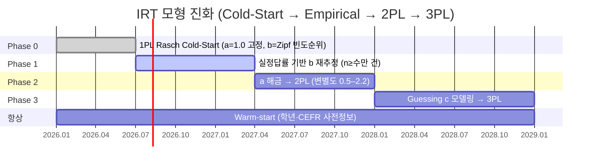
```mermaid
gantt
    title IRT 모형 진화 (Cold-Start → Empirical → 2PL → 3PL)
    dateFormat YYYY-MM
    axisFormat %Y.%m
    section Phase 0
    1PL Rasch Cold-Start (a=1.0 고정, b=Zipf 빈도순위) :done, p0, 2026-01, 6M
    section Phase 1
    실정답률 기반 b 재추정 (n≥수만 건)  :active, p1, 2026-07, 9M
    section Phase 2
    a 해금 → 2PL (변별도 0.5–2.2)         :p2, 2027-04, 9M
    section Phase 3
    Guessing c 모델링 → 3PL                :p3, 2028-01, 12M
    section 항상
    Warm-start (학년·CEFR 사전정보)        :warm, 2026-01, 36M
```

| Phase | 모델 | 핵심 작업 | 기대 효과 |
|---|---|---|---|
| **0** ✅ | 1PL Rasch | a=1.0 고정, b는 빈도순위 매핑 (Cold-Start) | 출시 가능한 최소 진단 시스템 |
| **1** 🔄 | 1PL+ | 실 정답률 로그로 **b 재이동** | b가 한국 학습자 특성에 맞춰 −3.0~+3.0 자동 조정 |
| **2** | 2PL | **a 해금** (변별도 동적 계산) | 매력적 오답 문항 a→1.5–2.2 자동 승격 = **특급 진단 문항** |
| **3** | 3PL | guessing parameter c | 찍기 보정, 하위권 정확도 추가 향상 |

> **데이터 네트워크 효과:** 풀이 로그가 쌓일수록 모델이 자동 정교화 → 신규 진입자가 따라오기 어려운 자산.
> 출처: `md-graph-db/docs/IRT_CALIBRATION_GUIDELINE.md`.

---

<!-- _class: layout-section -->

# 4 │ 목표까지의 거리와 로드맵

> 12 skill 사이엔 **선수관계(prerequisites)** 가 있다 → 학습 순서가 수학적으로 결정됨.
> 출처: `micro-skills.ts` (`prerequisites` 필드) + `recommender.ts`

---

<!-- _class: layout-chart-focus -->

## 4-A. Skill 선수관계 DAG — 학습 경로의 골격

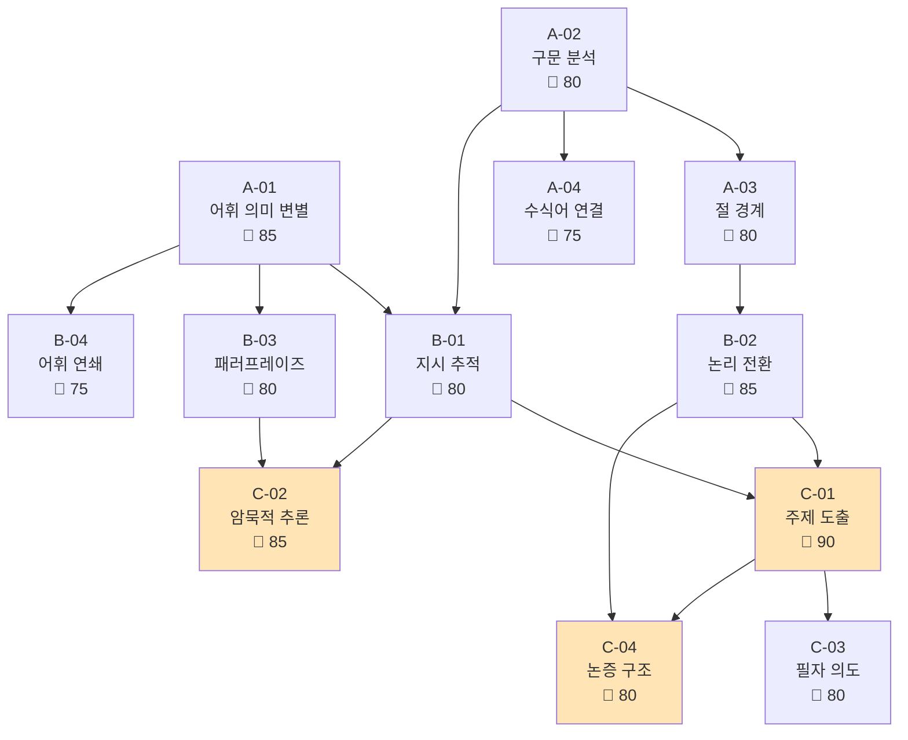
```mermaid
graph TD
    A01["A-01<br/>어휘 의미 변별<br/>🎯 85"]
    A02["A-02<br/>구문 분석<br/>🎯 80"]
    A03["A-03<br/>절 경계<br/>🎯 80"]
    A04["A-04<br/>수식어 연결<br/>🎯 75"]

    B01["B-01<br/>지시 추적<br/>🎯 80"]
    B02["B-02<br/>논리 전환<br/>🎯 85"]
    B03["B-03<br/>패러프레이즈<br/>🎯 80"]
    B04["B-04<br/>어휘 연쇄<br/>🎯 75"]

    C01["C-01<br/>주제 도출<br/>🎯 90"]
    C02["C-02<br/>암묵적 추론<br/>🎯 85"]
    C03["C-03<br/>필자 의도<br/>🎯 80"]
    C04["C-04<br/>논증 구조<br/>🎯 80"]

    A02 --> A03
    A02 --> A04
    A01 --> B01
    A02 --> B01
    A03 --> B02
    A01 --> B03
    A01 --> B04
    B01 --> C01
    B02 --> C01
    B01 --> C02
    B03 --> C02
    C01 --> C03
    B02 --> C04
    C01 --> C04

    style C01 fill:#ffe4b5
    style C02 fill:#ffe4b5
    style C04 fill:#ffe4b5
```

색칠된 노드 = **갭이 −40 이상**인 우선 보강 대상.

---

<!-- _class: layout-chart-focus -->

## 4-B. Recommender 알고리즘 — 우선순위 자동 결정

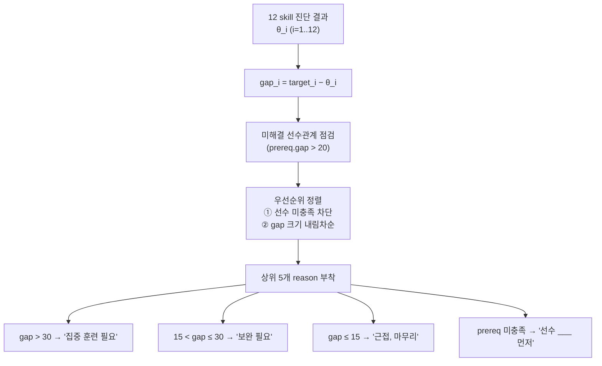
```mermaid
flowchart TD
    M["12 skill 진단 결과<br/>θ_i (i=1..12)"] --> G["gap_i = target_i − θ_i"]
    G --> P["미해결 선수관계 점검<br/>(prereq.gap > 20)"]
    P --> S["우선순위 정렬<br/>① 선수 미충족 차단<br/>② gap 크기 내림차순"]
    S --> R["상위 5개 reason 부착"]

    R --> R1["gap > 30 → '집중 훈련 필요'"]
    R --> R2["15 < gap ≤ 30 → '보완 필요'"]
    R --> R3["gap ≤ 15 → '근접, 마무리'"]
    R --> R4["prereq 미충족 → '선수 ___ 먼저'"]
```

출처: [`csat-text-graph-maker/src/lib/logicflow/recommender.ts`](https://github.com/smilepat/csat-text-graph-maker/blob/main/src/lib/logicflow/recommender.ts) `getRecommendations()`.

---

<!-- _class: layout-2col -->

## 4-C. 학습자 예시: 추천 로드맵 (5단계 우선순위)


```mermaid
xychart-beta
    title "예시 학습자: top-5 추천 skill의 현재 vs 목표 (gap 시각화)"
    x-axis ["①A-02 구문","②B-02 논리","③B-03 패러","④C-01 주제","⑤C-02 추론"]
    y-axis "마스터리 (0–100)" 0 --> 100
    bar [60, 45, 40, 55, 35]
    bar [80, 85, 80, 90, 85]
```

상단(현재) → 하단(목표). 막대 길이 차이 = gap.

| # | skill | 현재 → 목표 | gap | reason (recommender 자동 생성) |
|---:|---|---:|---:|---|
| ① | **A-02** 구문 분석 | 60 → 80 | −20 | 선수 차단 — B-02·C-04 진행 불가 |
| ② | **B-02** 논리 전환 | 45 → 85 | **−40** | 집중 훈련 필요 |
| ③ | **B-03** 패러프레이즈 | 40 → 80 | **−40** | 5개 유형 동시 영향 (2-C 참조) |
| ④ | **C-01** 주제 도출 | 55 → 90 | −35 | B-01·B-02 충족 후 진입 |
| ⑤ | **C-02** 암묵적 추론 | 35 → 85 | **−50** | B-03 보강 후 단계 진입 |

> **모든 학습자에게 다른 5개** 가 출력됨 → 일괄 커리큘럼의 종언. **순서는 gap 크기가 아니라 선수관계 우선** (4-A·4-B 참조).

---

<!-- _class: layout-2col -->

## 4-D. 케이스 스터디 — Student B: 410L → 1000L (2년 계획)

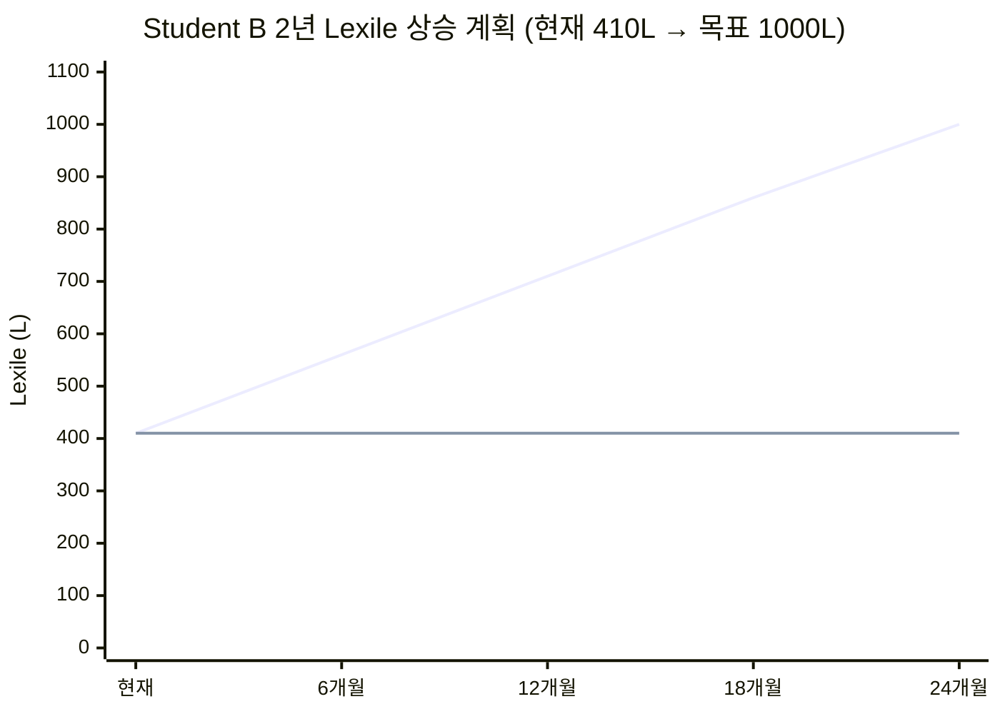
```mermaid
xychart-beta
    title "Student B 2년 Lexile 상승 계획 (현재 410L → 목표 1000L)"
    x-axis ["현재","6개월","12개월","18개월","24개월"]
    y-axis "Lexile (L)" 0 --> 1100
    line [410, 560, 710, 860, 1000]
    line [410, 410, 410, 410, 410]
```

상단(목표 경로) vs 하단(개입 없음 = 정체) — **390L 상승**이 분기점별 약 150L씩.

```python
def calculate_required_time(current_level, target_level):
    CEFR_gap = target_level - current_level
    return CEFR_gap * 300  # CEFR 1단계당 300시간 필요
```

| 항목 | 값 |
|---|---|
| **현재 Lexile** | **410L** (중1 수준, 평균 학생 궤적) |
| **목표 Lexile** | **1000L** (고1 수준, 목표 궤적) |
| **필요 상승** | 390L |
| **예상 소요** | **2년** (주 3회, **45분/회** 집중 학습) |
| **CEFR 1단계당** | 약 300시간 |
| **중점 학습 영역** | 다독, 복합문 분석, 추론적 독해, 학술 어휘 확장 |

> **추상→구체 ROI:** "390L가 2년 × 주 3회 × 45분 = 약 234시간"으로 *측정 가능한 목표*가 됨. 학부모·교사·학생이 같은 좌표축으로 의사결정.
> 출처: `Korea_English_Solution/components/personalized-roadmap.tsx`.

---

<!-- _class: layout-section -->

# 5 │ 계량화된 기반의 학습 경험 제공

> 진단 좌표가 정해지면, **거기에 정확히 맞는 문항을 거기서 즉시 생성**할 수 있어야 한다.
> 출처: `DATABASE_ARCHITECTURE.md` — 137,745 학습 문항 자산.

---

<!-- _class: layout-2col -->

## 5-A. 학습 문항 자산 — 데이터 + 생성 시스템

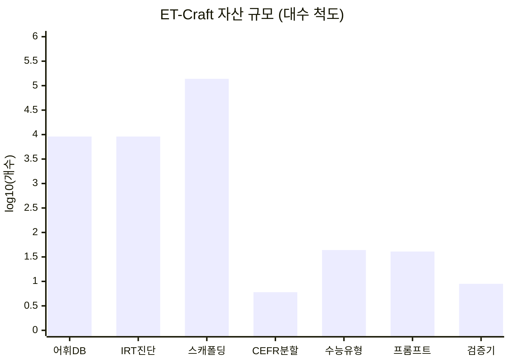
```mermaid
xychart-beta
    title "ET-Craft 자산 규모 (대수 척도)"
    x-axis ["어휘DB","IRT진단","스캐폴딩","CEFR분할","수능유형","프롬프트","검증기"]
    y-axis "log10(개수)" 0 --> 6
    bar [3.96, 3.96, 5.14, 0.78, 1.64, 1.61, 0.95]
```

| 자산 | 규모 | 비고 |
|---|---:|---|
| **마스터 어휘** | 9,183 단어 × 58 속성 | `vocab_master.sqlite` |
| **IRT 진단 문항** | 9,017 | 1PL Rasch, b ∈ [−3.00, +3.67] |
| **학습 스캐폴딩** | **137,745 문항** | 9,183 × 5D × 3 step (Gemini 2.5 Flash × 45,915 호출) |
| **CEFR 분할 패키지** | 6 | A1~C2 `learning_{Level}.json` |
| **수능 유형 풀커버리지** | **44** | LC 16 + RC 28 (`csat_itemgen` 모듈별 spec) |
| **유형별 프롬프트 라이브러리** | **41** | 224 KB, 버전·메트릭 추적 *(ET-Craft lineage, current core: EBS-demo)* |
| **모듈러 검증기** | **9** | common · grammar · gap · chart · listening · format · set 등 *(同上)* |

> 자산 차트는 자릿수 차이가 크므로 log10 척도. 핵심은 *"양"이 아니라 **구조화된 자산의 폭"*.

---

<!-- _class: layout-2col -->

## 5-B. 난이도가 좌표로 제어됨 — `learning_step` ↔ `b_value`

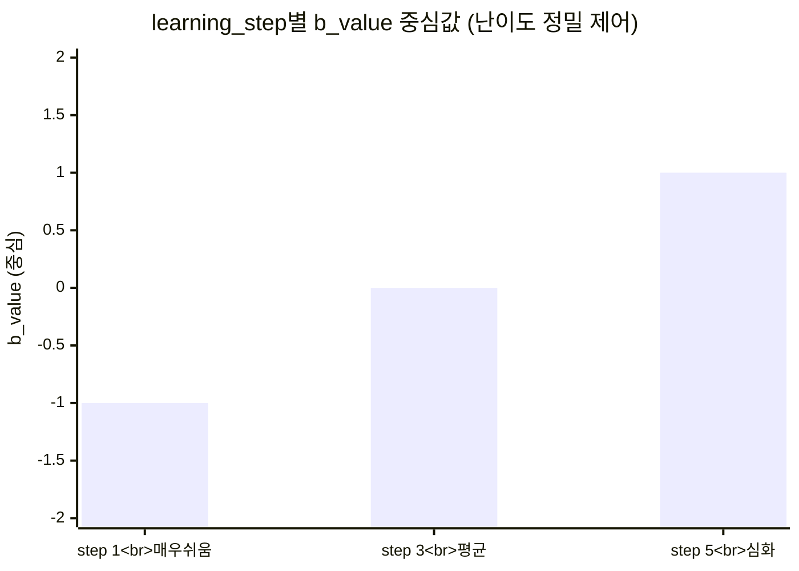
```mermaid
xychart-beta
    title "learning_step별 b_value 중심값 (난이도 정밀 제어)"
    x-axis ["step 1<br/>매우쉬움","step 3<br/>평균","step 5<br/>심화"]
    y-axis "b_value (중심)" -2.0 --> 2.0
    bar [-1.0, 0.0, 1.0]
```

| step | 의미 | b_value | 용도 |
|---:|---|---:|---|
| 1 | 매우 쉬움 | b−1.0 | 자신감 회복·기초 |
| 3 | 평균 | b±0 | 표준 학습 |
| 5 | 심화 | b+1.0 | 1등급 굳히기 |

같은 단어라도 **5D × 3step**로 15가지 학습 패턴 → "어려우면 더 쉬운 같은 단어"가 즉시 출제됨.

---

<!-- _class: layout-chart-focus -->

## 5-C. 2-Stage LLM × 9 검증기 × Issue Code 분기

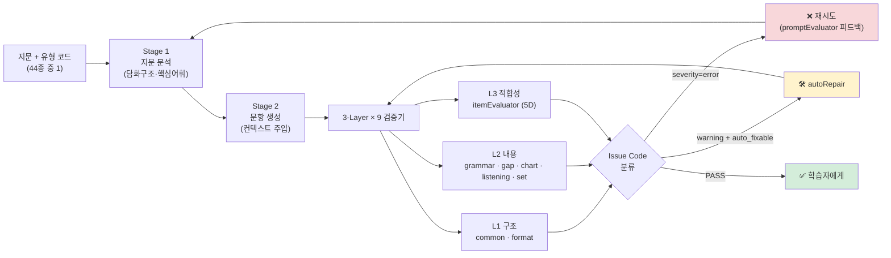
```mermaid
flowchart LR
    P["지문 + 유형 코드<br/>(44종 중 1)"] --> S1
    S1["Stage 1<br/>지문 분석<br/>(담화구조·핵심어휘)"] --> S2
    S2["Stage 2<br/>문항 생성<br/>(컨텍스트 주입)"] --> V

    V["3-Layer × 9 검증기"]
    V --> L1["L1 구조<br/>common · format"]
    V --> L2["L2 내용<br/>grammar · gap · chart · listening · set"]
    V --> L3["L3 적합성<br/>itemEvaluator (5D)"]

    L1 --> IC{"Issue Code<br/>분류"}
    L2 --> IC
    L3 --> IC
    IC -->|"severity=error"| FAIL["❌ 재시도<br/>(promptEvaluator 피드백)"]
    IC -->|"warning + auto_fixable"| FIX["🛠 autoRepair"]
    IC -->|"PASS"| OUT["✅ 학습자에게"]
    FIX --> V
    FAIL --> S1

    style OUT fill:#d4edda
    style FAIL fill:#f8d7da
    style FIX fill:#fff3cd
```

- **9 검증기 모듈** (`validator_common`, `_grammar`, `_gap`, `_chart`, `_listening`, `_format`, `_set` 등) — 유형별 전용 spec
- **3-Layer 검증** L1 구조 → L2 내용 → L3 수능 적합성
- **Issue Code 분기** 결과를 severity·auto_fixable 메타데이터로 라우팅 (`failed → 재시도` / `warning → autoRepair` / `pass → 출력`)

> 출처: ET-Craft 문항생성 계열 (`csat_itemgen` PRD, current core: `EBS-demo`).

---

<!-- _class: layout-2col -->

## 5-D. Issue Code 분류 체계 — 검증의 메타데이터화

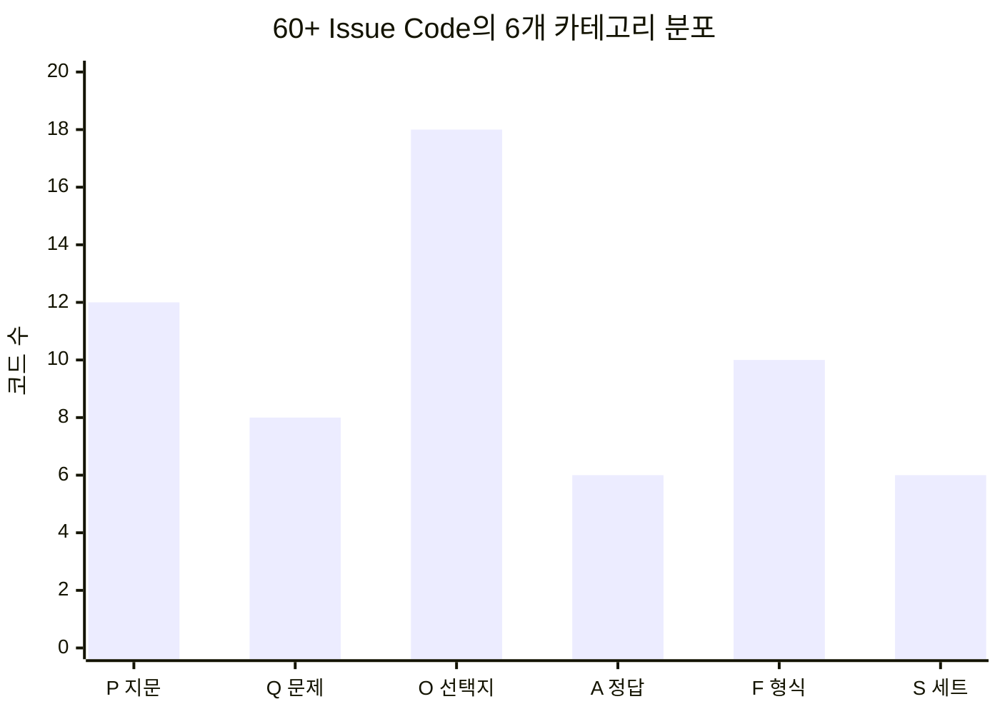
```mermaid
xychart-beta
    title "60+ Issue Code의 6개 카테고리 분포"
    x-axis ["P 지문","Q 문제","O 선택지","A 정답","F 형식","S 세트"]
    y-axis "코드 수" 0 --> 20
    bar [12, 8, 18, 6, 10, 6]
```

| 접두 | 영역 | 대표 코드 |
|---|---|---|
| **P0xx** | 지문 (Passage) | P001 너무 짧음 · P003 주제 이탈 |
| **Q0xx** | 문제 (Question) | Q001 지시문 불명확 · Q002 유형 불일치 |
| **O0xx** | 선택지 (Options) | O001 개수 오류 · **O003 매력도 낮음** · O005 복수정답 |
| **A0xx** | 정답 (Answer) | A001 정답 모호 · A002 범위 초과 |
| **F0xx** | 형식 (Format) | F001 JSON 구조 · F002 필드 누락 |
| **S0xx** | 세트 (Set) | S001 공통지문 불일치 (16-17·41-42·43-45) |

```json
{ "code": "O003", "severity": "warning", "auto_fixable": false,
  "message": "선택지 ②의 매력도가 낮음",
  "suggestion": "지문 맥락 관련 오답으로 교체",
  "location": "options[1]" }
```

> **함의:** 검증이 *분류·심각도·수정가능성* 3축으로 메타데이터화 → 자동 보정·재시도·통계 모두 가능. *"PASS/FAIL"이 아니라 **분류된 처방"*.

---

<!-- _class: layout-2col -->

## 5-E. 문항 생성 시스템 운영 KPI — 현재 vs 목표 5축 비교

```mermaid
xychart-beta
    title "5축 KPI 현재 추정 vs 목표 (모두 0–100 정규화, 클수록 좋음)"
    x-axis ["1회 통과율","검증 커버리지","오답 매력도","응답속도","재생성 절약"]
    y-axis "정규화 점수 (0–100)" 0 --> 100
    bar [30, 60, 40, 50, 30]
    bar [70, 95, 80, 90, 85]
```

상단(현재 추정) vs 하단(목표) — 5축 모두 *명확한 갭*. **검증 커버리지**가 가장 가까움, **재생성 절약과 1회 통과율이 가장 멀리**.

| KPI | 현재 | **목표** | 정규화 산식 | 측정 방법 |
|---|---:|---:|---|---|
| 1회 통과율 | 측정 인프라 구축 중 | **70%+** | 값 그대로 (%) | 생성 → 검증 PASS 비율 |
| 재생성 평균 횟수 | 同 | **≤ 1.5회** | (3 − 횟수)/3 × 100 | 최종 OK까지 LLM 호출 수 |
| 검증 커버리지 | ~60% (구조만) | **95%+** | 값 그대로 (%) | spec 대비 검증 항목 비율 |
| 오답 매력도 점수 | 미측정 | **80점+** | 값 그대로 | `itemEvaluator` 평균 distractor 점수 |
| 단일 문항 응답 | 미측정 | **< 30초** | (60 − 초)/60 × 100 | API 응답 시간 |

> 출처: ET-Craft lineage `PRD_IMPROVEMENT_2026.md` §2.2. **데이터 회사 포지셔닝의 정량 증거** — 콘텐츠가 아니라 *통제된 생성 시스템*.

---

<!-- _class: layout-section -->

# 6 │ 눈에 보이는 progress

> 진단·학습·재진단의 닫힌 루프 → **점수가 아닌 좌표의 이동**으로 성장을 본다.

---

<!-- _class: layout-chart-focus -->

## 6-A. Before / After — 12 skill 좌표 이동 (예시·추정)

```echarts h=500
{
  "title": { "text": "8주 학습 후 12 micro-skill 좌표 이동 (예시 학습자 · 추정값)", "left": "center", "top": 8 },
  "legend": { "data": ["Before (W0)", "After (W8)"], "bottom": 8 },
  "grid": { "left": 56, "right": 32, "top": 56, "bottom": 60, "containLabel": true },
  "xAxis": {
    "type": "category",
    "data": ["A-01","A-02","A-03","A-04","B-01","B-02","B-03","B-04","C-01","C-02","C-03","C-04"],
    "axisLabel": { "fontWeight": 600 }
  },
  "yAxis": { "type": "value", "name": "마스터리 (0–100)", "max": 100, "min": 0, "nameGap": 18 },
  "series": [
    {
      "name": "Before (W0)", "type": "bar",
      "data": [65,60,55,50,50,45,40,45,55,35,40,35],
      "itemStyle": { "color": "#94a3b8", "borderRadius": [4,4,0,0] },
      "barGap": "10%"
    },
    {
      "name": "After (W8)", "type": "bar",
      "data": [78,75,72,68,72,72,68,68,75,62,65,62],
      "itemStyle": { "color": "#10b981", "borderRadius": [4,4,0,0] },
      "label": {
        "show": true, "position": "top", "color": "#10b981", "fontSize": 11, "fontWeight": 600,
        "formatter": "+{@score}"
      }
    }
  ]
}
```

> ⚠️ **추정값**: Before·After 모두 정성적 진단 기반의 예시 학습자 시나리오. 실제 production 코호트(개입 전 첫 진단 vs 8주 경과 재진단의 페어드 평균, n≥30)로 교체 예정 — 트리거 조건은 [Plan §8.4](docs/01-plan/features/slides-cohort-replacement.plan.md) 참조.

**의미 설명:** B-03 패러프레이즈 40→68 (+28)의 효과로 빈칸·요지·내용일치 유형이 일제히 상승하는 *메커니즘*은 `QUESTION_TYPE_SKILL_MAP`이 보장(실측).

---

<!-- _class: layout-chart-focus -->

## 6-B. 마스터리 레벨 이동 — 시각적 카운트 (예시·추정)

```mermaid
xychart-beta
    title "마스터리 레벨별 skill 수 (Before → After · 추정)"
    x-axis ["Novice","Developing","Proficient","Mastered"]
    y-axis "skill 개수" 0 --> 12
    bar [3, 9, 0, 0]
    bar [0, 4, 8, 0]
```

> ⚠️ **추정값**: 6-A와 동일한 예시 학습자 시나리오에서 파생. 실측 시 6-A 페어드 코호트의 skill별 `MASTERY_LEVELS` 카운트로 교체.

**Before:** Novice 3 / Developing 9 → **After:** Developing 4 / Proficient 8.
다음 8주: **Proficient → Mastered** 게이트 진입 → 수능 1등급 영역.

---

<!-- _class: layout-chart-focus -->

## 6-C. 누적 학습 시간 ↔ θ 상승 — "노력의 가시화" (예시·추정)

```mermaid
xychart-beta
    title "누적 학습 시간 vs 평균 θ (학습자 코호트 · 추정 곡선)"
    x-axis ["W0","W2","W4","W6","W8","W10","W12"]
    y-axis "평균 θ (Rasch 척도)" -1.5 --> 1.5
    line [-1.2, -0.8, -0.4, 0.0, 0.4, 0.7, 1.0]
```

> ⚠️ **추정 곡선**: 실측 시 production 코호트의 주별 평균 θ (Rasch 척도)로 교체. `learnerEvidence`(evidence event 로그)를 mastery-engine으로 시점별 재생하여 산출.

**핵심:** θ가 0.0(=수능 평균 난이도 정답률 50%) → +1.0(=수능 상위권)으로 직진. **좌표축은 실측**(`md-graph-db/docs/IRT_CALIBRATION_GUIDELINE.md` b 범위 −3.00~+3.67), **진행 속도는 추정**.

---

<!-- _class: layout-chart-focus -->

## 6-D. 진단 → 학습 → 재진단 루프

```mermaid
flowchart LR
    D["📍 진단<br/>12 skill θ 측정"] --> R["🧭 Recommender<br/>top-5 우선순위"]
    R --> L["📚 학습<br/>137,745 풀에서<br/>step별 출제"]
    L --> Q["📝 풀이 로그<br/>(User, Item, Correct)"]
    Q --> U["θ 업데이트<br/>(Bayes/EAP)"]
    U --> D

    Q --> C["IRT 재캘리브레이션<br/>Phase 1→2→3"]
    C --> D

    style D fill:#cce5ff
    style L fill:#fff3cd
    style C fill:#d4edda
```

**모트(Moat):** 풀이 로그가 쌓일수록 b·a 파라미터가 한국 학습자에 맞춰 재조정됨 → **데이터 네트워크 효과**.

---

<!-- _class: layout-section -->

# 7 │ 시장·비즈니스 (Investor section)

> *교육적 진단을 끝낸 뒤*, **왜 이 시장에 진입하고, 왜 이 가격에 작동하며, 어떻게 카테고리를 점하는가**.
> 출처: `LECTURE_V2.md` 슬라이드 18–21.

---

<!-- _class: layout-2col -->

## 7-A. TAM — 3개 세그먼트 × 3개 채널

```mermaid
xychart-beta
    title "한국 영어교육 시장 도달 가능 세그먼트 (규모, 만 명/개)"
    x-axis ["고교생 (B2C)","영어교사 (B2B)","교육청 (B2G)"]
    y-axis "규모" 0 --> 60
    bar [50, 3, 0.0017]
```

| 세그먼트 | 규모 | 도달 채널 | 우선 진입 |
|---|---:|---|---|
| 고교 재학생 (수능 응시군) | **약 50만/연** | B2C / B2B2C | 🥇 |
| 영어교사 | 약 **3만** | B2B (ET-Craft 교사 도구) | 🥈 |
| 교육청·학교 | **17개 시·도** | B2G (LMS 어댑터) | 🥉 |

> **베이치헤드:** B2B(교사 도구)로 진입 — 교사 1명 → 학급 30명 = **1:30 레버리지**. 교사 신뢰 확보 후 B2C·B2G로 확장.

---

<!-- _class: layout-2col -->

## 7-B. 단가 비교 — 인간 강사 대비 **100–180배** 저렴

```echarts h=480
{
  "title": { "text": "문항 1개 제작 단가 비교 (원, log 스케일)", "subtext": "AI 원가 85원 · 인간 강사 8,000–15,000원 → 약 100–180배 차이", "left": "center", "top": 8 },
  "grid": { "left": 24, "right": 80, "top": 76, "bottom": 32, "containLabel": true },
  "xAxis": {
    "type": "log",
    "name": "원 (log)",
    "min": 1, "max": 20000,
    "axisLabel": {
      "formatter": "{value}원",
      "fontWeight": 600
    },
    "splitLine": { "lineStyle": { "color": "#e2e8f0" } }
  },
  "yAxis": {
    "type": "category",
    "data": ["검증·후처리", "Stage 1 분석", "Stage 2 생성", "AI 원가 합계", "인간 강사 (저)", "인간 강사 (고)"],
    "axisLabel": { "fontWeight": 600 },
    "axisLine": { "show": false },
    "axisTick": { "show": false }
  },
  "series": [{
    "type": "bar",
    "data": [
      { "value": 5,     "itemStyle": { "color": "#dbeafe" } },
      { "value": 30,    "itemStyle": { "color": "#93c5fd" } },
      { "value": 50,    "itemStyle": { "color": "#3b82f6" } },
      { "value": 85,    "itemStyle": { "color": "#2563eb" } },
      { "value": 8000,  "itemStyle": { "color": "#fca5a5" } },
      { "value": 15000, "itemStyle": { "color": "#ef4444" } }
    ],
    "label": {
      "show": true, "position": "right",
      "fontWeight": 600, "fontSize": 13,
      "formatter": "{c}원"
    },
    "barWidth": "62%"
  }]
}
```

| 비용 항목 | 단가 |
|---|---:|
| Stage 1 분석 (~1.5K 토큰) | 약 **30원** |
| Stage 2 생성 (~2K 토큰) | 약 **50원** |
| 검증·후처리 (CPU) | 약 **5원** |
| **AI 원가 (문항 1개)** | **약 85원** |
| 인간 강사 제작 단가 (시급 환산) | 약 8,000–15,000원 |
| → **비용 차이** | **약 100–180배** |

> 마진율이 충분히 두꺼워 토큰 가격 인상도 흡수 가능. 자체 데이터 기반 sLLM 파인튜닝 시 비용 추가 1/10.
> 출처: `LECTURE_V2.md` 슬라이드 19 (Azure OpenAI GPT-4-turbo 기준 추정치).

---

<!-- _class: layout-2col -->

## 7-C. D5 모드 vs 인간 1:1 코칭 — 카테고리 정의

```mermaid
xychart-beta
    title "월 단가·시간 도달·일관성 비교"
    x-axis ["월 단가 (만원)","주당 세션","일관성 (0-10)"]
    y-axis "값 (단위 별 정규화)" 0 --> 80
    bar [65, 1.5, 5]
    bar [2, 7, 9]
```

상단 = **인간 1:1 코칭** / 하단 = **ET-Craft D5 모드**

| 항목 | 인간 1:1 코칭 | ET-Craft D5 모드 | 비율 |
|---|---|---|---|
| 월 단가 | 약 **50–80만원** | 약 **1–3만원** (크레딧) | **1/20–1/50** |
| 시간 도달 | 주 1–2회 | **매일** | 5–7배 |
| 데이터 일관성 | 강사별 편차 | 일관 (로그 기반) | — |
| 효용 (인간 코칭 = 100%) | 100% | **70–80%** | — |

> **카테고리 정의:** *70–80% 효용을 1/20–1/50 단가에*. 인간 코칭 시장 자체를 재정의하는 비율.
> 출처: `LECTURE_V2.md` 슬라이드 18.

---

<!-- _class: layout-2col -->

## 7-D. 경쟁 포지셔닝 — 5축에서 우리만 풀스택

```echarts h=500
{
  "title": { "text": "경쟁 포지셔닝 5축 비교 (★ 0–3)", "subtext": "ET-Craft만 5축 풀스택", "left": "center", "top": 8 },
  "legend": { "data": ["인강 (메가·EBSi)", "학습지 앱", "일반 AI 챗봇", "ET-Craft"], "bottom": 8 },
  "radar": {
    "indicator": [
      { "name": "콘텐츠 자산",  "max": 3 },
      { "name": "진단 깊이",    "max": 3 },
      { "name": "생성 자동화",  "max": 3 },
      { "name": "저작권 엔진",  "max": 3 },
      { "name": "LMS 통합",     "max": 3 }
    ],
    "radius": "62%",
    "center": ["50%", "54%"],
    "splitArea": { "areaStyle": { "color": ["#fafbfc", "#ffffff"] } },
    "axisName": { "color": "#0f172a", "fontWeight": 600 }
  },
  "series": [{
    "type": "radar",
    "emphasis": { "focus": "self" },
    "data": [
      { "name": "인강 (메가·EBSi)", "value": [3, 1, 0, 0, 0],
        "lineStyle": { "width": 2, "color": "#94a3b8" },
        "itemStyle": { "color": "#94a3b8" },
        "areaStyle": { "color": "rgba(148, 163, 184, 0.10)" } },
      { "name": "학습지 앱", "value": [2, 2, 0, 0, 0],
        "lineStyle": { "width": 2, "color": "#f59e0b" },
        "itemStyle": { "color": "#f59e0b" },
        "areaStyle": { "color": "rgba(245, 158, 11, 0.10)" } },
      { "name": "일반 AI 챗봇", "value": [1, 0, 2, 0, 0],
        "lineStyle": { "width": 2, "color": "#8b5cf6" },
        "itemStyle": { "color": "#8b5cf6" },
        "areaStyle": { "color": "rgba(139, 92, 246, 0.10)" } },
      { "name": "ET-Craft", "value": [2, 3, 3, 3, 3],
        "lineStyle": { "width": 3, "color": "#2563eb" },
        "itemStyle": { "color": "#2563eb" },
        "areaStyle": { "color": "rgba(37, 99, 235, 0.22)" } }
    ]
  }]
}
```

| 플레이어 | 콘텐츠 자산 | 진단 깊이 | 생성 자동화 | 저작권 엔진 | LMS 통합 | 총점 |
|---|---|---|---|---|---|---:|
| 인강(메가·EBSi) | ★★★ | ★ | ✗ | ✗ | ✗ | 4 |
| 학습지 앱 | ★★ | ★★ | ✗ | ✗ | ✗ | 4 |
| 일반 AI 챗봇 | ★ | ✗ | ★★ | ✗ | ✗ | 3 |
| **ET-Craft** | ★★ | **★★★** | **★★★** | **★★★** | **★★★** | **14** |

> 인강 회사가 이 자리에 오려면 **AI팀을 처음부터**, AI 회사는 **18년치 수능 데이터를 새로**. 둘 다 시간으로만 살 수 있는 자산.
> 출처: `LECTURE_V2.md` 슬라이드 20.

---

<!-- _class: layout-2col -->

## 7-E. 마일스톤 — 2026.06 베타 → 2027 하반기 sLLM

```mermaid
gantt
    title ET-Craft 로드맵 (체크 가능한 KPI 포함)
    dateFormat YYYY-MM
    section MVP·확장
    베타 런칭 (학교 100명)         :a1, 2026-06, 6M
    B2C 학생 응시 시스템             :a2, after a1, 6M
    section 정책·확장
    B2G 시·도 교육청 계약 3건       :b1, 2027-01, 6M
    sLLM 파인튜닝 (토큰 1/3 절감)   :b2, 2027-07, 6M
    section 장기
    인접 도메인 이식 (국어 비문학)   :c1, 2028-01, 12M
```

| 시점 | 마일스톤 | 핵심 KPI |
|---|---|---|
| **2026.06** | 베타 런칭 (일부 학교) | 교사 100명, 문항 생성 5,000건 |
| **2026 하반기** | B2C 학생 응시 시스템 | 학급 단위 시험 1,000건 |
| **2027 상반기** | B2G 시·도 교육청 확장 | 계약 3건 |
| **2027 하반기** | sLLM 파인튜닝 | 토큰 비용 **1/3** 절감 |
| **장기** | 인접 도메인 (국어 비문학) | 5D 프레임 재사용 |

> 마일스톤마다 *체크 가능한 숫자*. 투자 후 6·12개월 KPI 합의에 그대로 사용 가능.
> 출처: `LECTURE_V2.md` 슬라이드 21.

---

<!-- _class: layout-chart-focus -->

## 8. K-12 확장 — 수능을 정점으로 한 6-Layer ontology

```echarts w=1200 h=680
{
  "title": { "text": "43-Skill Ontology DAG — 수능을 정점으로 한 K-12 단일 좌표계", "subtext": "Vertical 39 (Layer 0→5) + Cross-cutting Layer D 4 · 실선=선수관계 · 점선=Layer D 메타", "left": "center", "top": 4 },
  "legend": { "data": [
    {"name": "L0 Phonics (5)"},
    {"name": "L1 Conv·Vocab (5)"},
    {"name": "L2 Elem Read (5)"},
    {"name": "L3 Mid Read (6)"},
    {"name": "L4 High Read (6)"},
    {"name": "L5 CSAT ★ (12)"},
    {"name": "Layer D 메타·행동 (4)"}
  ], "bottom": 8, "icon": "circle", "itemGap": 14 },
  "tooltip": { "trigger": "item", "formatter": "{b}" },
  "series": [{
    "type": "graph",
    "layout": "none",
    "roam": false,
    "draggable": false,
    "symbol": "circle",
    "symbolSize": 30,
    "edgeSymbol": ["none", "arrow"],
    "edgeSymbolSize": 6,
    "label": { "show": true, "position": "inside", "fontSize": 9, "fontWeight": 600, "color": "#fff" },
    "lineStyle": { "color": "#94a3b8", "width": 1, "opacity": 0.5, "curveness": 0.05 },
    "emphasis": { "focus": "adjacency", "lineStyle": { "width": 2 } },
    "categories": [
      {"name": "L0 Phonics (5)",        "itemStyle": {"color": "#64748b"}},
      {"name": "L1 Conv·Vocab (5)",     "itemStyle": {"color": "#f59e0b"}},
      {"name": "L2 Elem Read (5)",      "itemStyle": {"color": "#fb923c"}},
      {"name": "L3 Mid Read (6)",       "itemStyle": {"color": "#10b981"}},
      {"name": "L4 High Read (6)",      "itemStyle": {"color": "#2563eb"}},
      {"name": "L5 CSAT ★ (12)",        "itemStyle": {"color": "#1e40af"}},
      {"name": "Layer D 메타·행동 (4)", "itemStyle": {"color": "#8b5cf6"}}
    ],
    "data": [
      {"name": "A-01", "category": 5, "x": 460, "y": 70,  "symbolSize": 36, "tooltip": {"formatter": "A-01 어휘 의미 변별 (L5 CSAT)"}},
      {"name": "A-02", "category": 5, "x": 560, "y": 70,  "symbolSize": 36, "tooltip": {"formatter": "A-02 구문 분석 (L5 CSAT)"}},
      {"name": "A-03", "category": 5, "x": 660, "y": 70,  "symbolSize": 36, "tooltip": {"formatter": "A-03 절 경계 (L5 CSAT)"}},
      {"name": "A-04", "category": 5, "x": 760, "y": 70,  "symbolSize": 36, "tooltip": {"formatter": "A-04 수식어 연결 (L5 CSAT)"}},
      {"name": "B-01", "category": 5, "x": 460, "y": 140, "symbolSize": 36, "tooltip": {"formatter": "B-01 지시 추적 (L5 CSAT)"}},
      {"name": "B-02", "category": 5, "x": 560, "y": 140, "symbolSize": 36, "tooltip": {"formatter": "B-02 논리 전환 (L5 CSAT)"}},
      {"name": "B-03", "category": 5, "x": 660, "y": 140, "symbolSize": 36, "tooltip": {"formatter": "B-03 패러프레이즈 (L5 CSAT)"}},
      {"name": "B-04", "category": 5, "x": 760, "y": 140, "symbolSize": 36, "tooltip": {"formatter": "B-04 어휘 연쇄 (L5 CSAT)"}},
      {"name": "C-01", "category": 5, "x": 460, "y": 210, "symbolSize": 38, "tooltip": {"formatter": "C-01 주제 도출 ★ (L5 CSAT)"}},
      {"name": "C-02", "category": 5, "x": 560, "y": 210, "symbolSize": 38, "tooltip": {"formatter": "C-02 암묵적 추론 (L5 CSAT)"}},
      {"name": "C-03", "category": 5, "x": 660, "y": 210, "symbolSize": 38, "tooltip": {"formatter": "C-03 필자 의도 (L5 CSAT)"}},
      {"name": "C-04", "category": 5, "x": 760, "y": 210, "symbolSize": 38, "tooltip": {"formatter": "C-04 논증 구조 (L5 CSAT)"}},
      {"name": "HR-01", "category": 4, "x": 300, "y": 310, "tooltip": {"formatter": "HR-01 학술 어휘 AWL (L4)"}},
      {"name": "HR-02", "category": 4, "x": 410, "y": 310, "tooltip": {"formatter": "HR-02 긴 문장 분석 (L4)"}},
      {"name": "HR-03", "category": 4, "x": 520, "y": 310, "tooltip": {"formatter": "HR-03 담화 표지 (L4)"}},
      {"name": "HR-04", "category": 4, "x": 630, "y": 310, "tooltip": {"formatter": "HR-04 단락 간 관계 (L4)"}},
      {"name": "HR-05", "category": 4, "x": 740, "y": 310, "tooltip": {"formatter": "HR-05 함축 의미 (L4)"}},
      {"name": "HR-06", "category": 4, "x": 850, "y": 310, "tooltip": {"formatter": "HR-06 글의 구조 (L4)"}},
      {"name": "MR-01", "category": 3, "x": 300, "y": 400, "tooltip": {"formatter": "MR-01 복합문 분석 (L3)"}},
      {"name": "MR-02", "category": 3, "x": 410, "y": 400, "tooltip": {"formatter": "MR-02 부사절 의미 (L3)"}},
      {"name": "MR-03", "category": 3, "x": 520, "y": 400, "tooltip": {"formatter": "MR-03 명시 대명사 지시 (L3)"}},
      {"name": "MR-04", "category": 3, "x": 630, "y": 400, "tooltip": {"formatter": "MR-04 단락 주제 (L3)"}},
      {"name": "MR-05", "category": 3, "x": 740, "y": 400, "tooltip": {"formatter": "MR-05 단순 추론 (L3)"}},
      {"name": "MR-06", "category": 3, "x": 850, "y": 400, "tooltip": {"formatter": "MR-06 어휘 맥락 추론 (L3)"}},
      {"name": "ER-01", "category": 2, "x": 330, "y": 480, "tooltip": {"formatter": "ER-01 짧은 문장 이해 (L2)"}},
      {"name": "ER-02", "category": 2, "x": 460, "y": 480, "tooltip": {"formatter": "ER-02 NP·VP 인식 (L2)"}},
      {"name": "ER-03", "category": 2, "x": 590, "y": 480, "tooltip": {"formatter": "ER-03 기본 시제 (L2)"}},
      {"name": "ER-04", "category": 2, "x": 720, "y": 480, "tooltip": {"formatter": "ER-04 그림 단서 활용 (L2)"}},
      {"name": "ER-05", "category": 2, "x": 850, "y": 480, "tooltip": {"formatter": "ER-05 명시적 정보 찾기 (L2)"}},
      {"name": "CV-01", "category": 1, "x": 330, "y": 555, "tooltip": {"formatter": "CV-01 일상 어휘 (L1)"}},
      {"name": "CV-02", "category": 1, "x": 460, "y": 555, "tooltip": {"formatter": "CV-02 인사·자기소개 (L1)"}},
      {"name": "CV-03", "category": 1, "x": 590, "y": 555, "tooltip": {"formatter": "CV-03 기본 질문·답변 (L1)"}},
      {"name": "CV-04", "category": 1, "x": 720, "y": 555, "tooltip": {"formatter": "CV-04 발음·억양 (L1)"}},
      {"name": "CV-05", "category": 1, "x": 850, "y": 555, "tooltip": {"formatter": "CV-05 듣고 따라하기 (L1)"}},
      {"name": "P-01", "category": 0, "x": 330, "y": 625, "tooltip": {"formatter": "P-01 음소 인식 (L0)"}},
      {"name": "P-02", "category": 0, "x": 460, "y": 625, "tooltip": {"formatter": "P-02 자소-음소 대응 (L0)"}},
      {"name": "P-03", "category": 0, "x": 590, "y": 625, "tooltip": {"formatter": "P-03 단어 해독 (L0)"}},
      {"name": "P-04", "category": 0, "x": 720, "y": 625, "tooltip": {"formatter": "P-04 유창성 (L0)"}},
      {"name": "P-05", "category": 0, "x": 850, "y": 625, "tooltip": {"formatter": "P-05 사이트 워드 (L0)"}},
      {"name": "D-01", "category": 6, "x": 1050, "y": 170, "tooltip": {"formatter": "D-01 오답 소거 (Layer D 메타)"}},
      {"name": "D-02", "category": 6, "x": 1050, "y": 280, "tooltip": {"formatter": "D-02 반복 읽기 패턴 (Layer D)"}},
      {"name": "D-03", "category": 6, "x": 1050, "y": 390, "tooltip": {"formatter": "D-03 정체 구간 (Layer D)"}},
      {"name": "D-04", "category": 6, "x": 1050, "y": 500, "tooltip": {"formatter": "D-04 번역 의존도 (Layer D)"}}
    ],
    "links": [
      {"source": "P-01", "target": "P-02"},
      {"source": "P-02", "target": "P-03"},
      {"source": "P-02", "target": "P-05"},
      {"source": "P-03", "target": "P-04"},
      {"source": "P-05", "target": "P-04"},
      {"source": "P-03", "target": "CV-01"},
      {"source": "P-05", "target": "CV-01"},
      {"source": "P-04", "target": "CV-04"},
      {"source": "CV-01", "target": "CV-02"},
      {"source": "CV-01", "target": "CV-03"},
      {"source": "CV-04", "target": "CV-05"},
      {"source": "CV-01", "target": "ER-01"},
      {"source": "P-04", "target": "ER-01"},
      {"source": "ER-01", "target": "ER-02"},
      {"source": "ER-01", "target": "ER-04"},
      {"source": "ER-01", "target": "ER-05"},
      {"source": "ER-02", "target": "ER-03"},
      {"source": "CV-03", "target": "ER-03"},
      {"source": "ER-02", "target": "MR-01"},
      {"source": "ER-03", "target": "MR-01"},
      {"source": "MR-01", "target": "MR-02"},
      {"source": "MR-01", "target": "MR-03"},
      {"source": "ER-05", "target": "MR-03"},
      {"source": "MR-01", "target": "MR-04"},
      {"source": "ER-05", "target": "MR-04"},
      {"source": "ER-05", "target": "MR-05"},
      {"source": "CV-01", "target": "MR-05"},
      {"source": "ER-05", "target": "MR-06"},
      {"source": "CV-01", "target": "MR-06"},
      {"source": "CV-01", "target": "HR-01"},
      {"source": "MR-01", "target": "HR-02"},
      {"source": "MR-02", "target": "HR-03"},
      {"source": "MR-04", "target": "HR-03"},
      {"source": "MR-04", "target": "HR-04"},
      {"source": "HR-03", "target": "HR-04"},
      {"source": "MR-05", "target": "HR-05"},
      {"source": "HR-04", "target": "HR-05"},
      {"source": "HR-04", "target": "HR-06"},
      {"source": "MR-04", "target": "HR-06"},
      {"source": "HR-01", "target": "A-01", "lineStyle": {"opacity": 0.35}},
      {"source": "HR-02", "target": "A-02", "lineStyle": {"opacity": 0.35}},
      {"source": "HR-03", "target": "A-03", "lineStyle": {"opacity": 0.35}},
      {"source": "HR-04", "target": "B-02", "lineStyle": {"opacity": 0.35}},
      {"source": "HR-05", "target": "C-02", "lineStyle": {"opacity": 0.35}},
      {"source": "HR-06", "target": "C-04", "lineStyle": {"opacity": 0.35}},
      {"source": "A-02", "target": "A-03"},
      {"source": "A-02", "target": "A-04"},
      {"source": "A-01", "target": "B-01"},
      {"source": "A-02", "target": "B-01"},
      {"source": "A-03", "target": "B-02"},
      {"source": "A-01", "target": "B-03"},
      {"source": "A-01", "target": "B-04"},
      {"source": "B-01", "target": "C-01"},
      {"source": "B-02", "target": "C-01"},
      {"source": "B-01", "target": "C-02"},
      {"source": "B-03", "target": "C-02"},
      {"source": "C-01", "target": "C-03"},
      {"source": "B-02", "target": "C-04"},
      {"source": "C-01", "target": "C-04"},
      {"source": "D-01", "target": "C-01", "lineStyle": {"type": "dashed", "color": "#8b5cf6", "opacity": 0.5}},
      {"source": "D-02", "target": "MR-04", "lineStyle": {"type": "dashed", "color": "#8b5cf6", "opacity": 0.5}},
      {"source": "D-03", "target": "HR-04", "lineStyle": {"type": "dashed", "color": "#8b5cf6", "opacity": 0.5}},
      {"source": "D-04", "target": "MR-01", "lineStyle": {"type": "dashed", "color": "#8b5cf6", "opacity": 0.5}}
    ]
  }]
}
```

**43 skill의 단일 좌표 vector** — 학습자 1명이 P-01부터 C-04까지 단일 trajectory · 학부모·교사·교육청이 *같은 좌표축*으로 의사결정.

| 핵심 사실 | 값 |
|---|---|
| 전체 skill | **43** (vertical 39 + Layer D cross-cutting 4) |
| 신규 콘텐츠 생성 | **~6,500** (기존 137,745 + 재사용 49,000 활용 후) |
| Phase 0 즉시 시작 가능 | **1주 sprint** (신규 콘텐츠 0건, 매핑·로직만) |
| 통합 PRD | [`smilepat/phonics2csat`](https://github.com/smilepat/phonics2csat) v2.0 |
| AIDT(2025) 정합 | 초3·4 / 중1 / 고1 전 학년대 커버 |

> 본 deck의 Layer 5 (CSAT 16 skill)가 더 큰 ontology의 *정점*. 7-E 마일스톤 Phase 4의 *Apple EEP K-12 trajectory 단일 SOT*가 본 ontology에 의해 실현.
> 출처: [phonics2csat PRD v2.0](https://github.com/smilepat/phonics2csat/blob/main/docs/01-plan/features/k12-english-pipeline.prd.md), [Phase 0 Plan](https://github.com/smilepat/phonics2csat/blob/main/docs/01-plan/features/phase0-upstream-mapping.plan.md).

---

<!-- _class: lead -->

# 한 줄 요약

> **"학습자의 거리, 좌표로 측정한다."**

```mermaid
flowchart LR
    S1["① 갭 인식<br/>Lexile · 어휘 · Bloom"]
    S2["② 역량 분해<br/>12 micro-skill<br/>× 4 mastery"]
    S3["③ 진단<br/>1PL Rasch IRT<br/>CAT"]
    S4["④ 로드맵<br/>Prerequisite DAG<br/>+ Recommender"]
    S5["⑤ 학습<br/>137,745 문항<br/>× 2-Stage LLM"]
    S6["⑥ Progress<br/>θ 이동 +<br/>마스터리 게이트"]

    S1 --> S2 --> S3 --> S4 --> S5 --> S6
    S6 -.재진단.-> S3

    style S1 fill:#fee2e2,stroke:#dc2626
    style S2 fill:#fed7aa,stroke:#ea580c
    style S3 fill:#fef3c7,stroke:#ca8a04
    style S4 fill:#d1fae5,stroke:#059669
    style S5 fill:#dbeafe,stroke:#2563eb
    style S6 fill:#e9d5ff,stroke:#9333ea
```

| 단계 | 핵심 출처 |
|---|---|
| ① 갭 인식 | `md-graph-db/et-craft/lecture_v2.md` |
| ② 역량 분해 | `csat-text-graph-maker/.../micro-skills.ts` (12 skill × `MASTERY_LEVELS`) |
| ③ 진단 | `md-graph-db/docs/IRT_CALIBRATION_GUIDELINE.md` (b ∈ [−3.00, +3.67]) |
| ④ 로드맵 | `.../logicflow/recommender.ts` (`getRecommendations`) |
| ⑤ 학습 | `md-graph-db/docs/DATABASE_ARCHITECTURE.md` (137,745) + ET-Craft lineage (9 검증기, Issue Code) |
| ⑥ Progress | `csat-graphdb-318/.../schema.ts` (`learnerMastery`, `learnerEvidence`) |

---

# 부록 — 데이터 출처 (재현성)

## ✅ 실측 · 정규(canonical) 자료

- 12 micro-skill 정의·목표·선수관계 — `csat-text-graph-maker/src/lib/logicflow/micro-skills.ts` (`GRADE1_TARGETS`)
- 12-canonical 결정 (Layer A+B+C, D 제외) — `logicflow-corpus/docs/skill-mapping.md` (D2, 2026-05-17)
- 학습 자산 137,745 · 진단 9,017 · 어휘 9,183 — `md-graph-db/docs/DATABASE_ARCHITECTURE.md`
- IRT 1PL Rasch · b 범위 −3.00~+3.67 · Warm-start — `md-graph-db/docs/IRT_CALIBRATION_GUIDELINE.md`
- 교과과정 누적 어휘 800/2,300/4,000/6,000 word families — `ai-english-platform/app/api/dashboard/vocab-level/route.ts` (`CURRICULUM_BANDS`)
- Lexile 학년 표(중3 700L~수능 1200L) · Bloom 비대칭 · 93초/문항 — `md-graph-db/et-craft/lecture_v2.md`
- Recommender 우선순위·reason 로직 — `csat-text-graph-maker/src/lib/logicflow/recommender.ts`
- 2-Stage 파이프라인 · 3-Layer 검증 — `md-graph-db/et-craft/ET-Craft_Presentation.md`
- 19개 수능 유형 ↔ 12 skill 매핑 — `csat-text-graph-maker/.../micro-skills.ts` `QUESTION_TYPE_SKILL_MAP`
- `learnerMastery` / `learnerEvidence` / `diagnosticSessions` 스키마 — `csat-graphdb-318/src/lib/db/schema.ts`

## ⚠️ 추정 · 보류 자료 (실측 대기 중)

다음 슬라이드의 학습자 수치는 정성 진단에서 역추정한 **placeholder**입니다. 추정 사실은 본문 슬라이드에도 명시 라벨링되어 있습니다.

| 슬라이드 | 추정 항목 | 실측 산출 방법 (예정) |
|---|---|---|
| 2-A 하단 막대 | 12 skill 교과과정 도달치 (65/60/55/50/50/45/40/45/55/35/40/35) | 신규 가입 7일 이내 첫 진단 완료자의 skill별 평균 (`learnerMastery`, n≥30) |
| 6-A Before/After | 12 skill × 2(Before·After) = 24개 수치 | 개입 전 첫 진단 vs 56일 후 재진단의 페어드 코호트 평균 (`learnerEvidence` 시점 재생) |
| 6-B 마스터리 분포 | (3,9,0,0) → (0,4,8,0) | 6-A와 동일 코호트의 skill별 `MASTERY_LEVELS` 카운트 |
| 6-C θ 곡선 | W0–W12 7개 값 | 6-A 코호트의 주별 평균 θ (Rasch 척도, mastery-engine 재생) |

**현 상태 (2026-05-18):**

- 스키마 점검: ✅ 모든 테이블·컬럼 존재 (`csat-graphdb-318` 검증 완료)
- 데이터 점검: ❌ production 학습자 누적 0 (3개 레포 모두 demo-user / visitor=default MVP 단계)
- 재개 트리거: production 배포 후 distinct uid 30+, 또는 학원·학교 pilot 코호트 형성 시
- PDCA 추적: [docs/01-plan/features/slides-cohort-replacement.plan.md](docs/01-plan/features/slides-cohort-replacement.plan.md) §8 (Plan-B)

**투자자 Q&A 응대 가이드:** "이 수치는 추정입니다 — 다만 ① 어떤 코호트로 ② 어떤 쿼리로 교체할지 ③ 어떤 임계값(n≥30)에서 신뢰할지가 모두 Plan §8에 명시되어 있고, 동일 시스템(`learnerMastery` API)이 운영 중입니다. 데이터 회사답게 *측정 방법론을 먼저 정의*하고 있습니다."

## 🌐 정책·시장 컨텍스트 (외부 정합)

Part 7(시장·비즈니스) 슬라이드의 외부 검증 가능한 정책·현장 신호. [PITCH_DECK.marp.md](PITCH_DECK.marp.md) Slide 11–12와 동일 출처.

- **AI 디지털교과서 (AIDT)** — 2025년 영어·수학·정보 본격 도입 (초3·4, 중1, 고1) · 교육부 정책 · `aidt.keris.or.kr`
- **경기도교육청 하이러닝** — 2025–2026 학교 제공 중 (교육청 플랫폼 통합 deployment 사례)
- **KERIS–Samsung Solar School Project** — 아프리카 5개국 학교 배포 (온디바이스 임베디드 deployment 사례)

> 이 신호들은 7-A TAM(B2G 17개 시·도) 및 7-E 마일스톤(2026 Q3 pilot · 2027 Q1 region)의 외부 정합 근거. **AI 디지털교과서 정책으로 학교당 1인 1기기 환경이 기 구축**되어 ET-Craft 도입 시 별도 인프라 비용 0.
