<!-- _class: lead -->

# 수능 영어, 거리로 보다
### 교육과정 ↔ 수능 ↔ 학습자 역량을 하나의 좌표계에 올리는 시스템

**근거 레포:** `md-graph-db` · `csat-text-graph-maker` · `ai-english-platform` · `vocabulary-db`

---

# 1 │ 교육과정과 수능영어수준의 격차

> *교과과정의 약속*과 *수능이 요구하는 능력* 사이에는 **수학적·구조적 갭**이 존재한다.
> 출처: [`et-craft/lecture_v2.md`](https://github.com/smilepat/md-graph-db/blob/main/et-craft/lecture_v2.md), [`docs/DATABASE_ARCHITECTURE.md`](https://github.com/smilepat/md-graph-db/blob/main/docs/DATABASE_ARCHITECTURE.md)

---

## 1-A. Lexile 곡선 — "고2 → 수능"에서 200–400L 점프

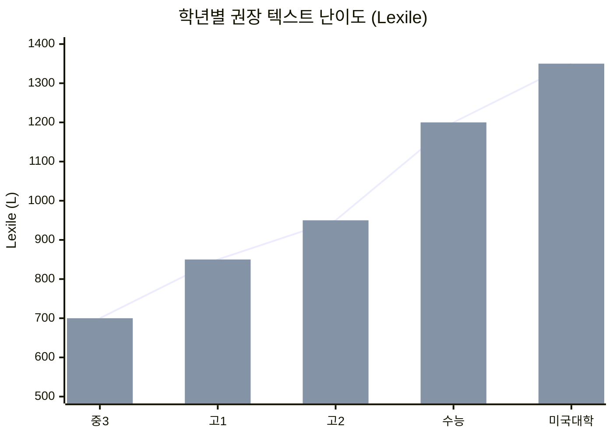

**한 줄:** 정규 수업 주 4시간으로 200–400L를 메우는 건 *수학적으로* 불가능 → 사교육 의존이 **구조적으로** 형성됨.

---

## 1-B. 어휘 누적 곡선 — 초등 800 → 수능 6,000 word families

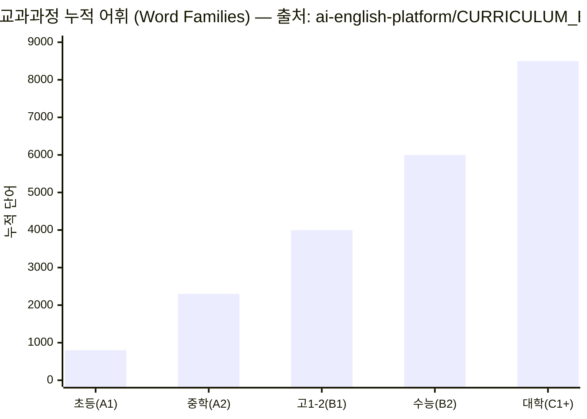

| 구간 | CEFR | 누적 word family | 출처 |
|---|---|---:|---|
| 초등 | A1 | 800 | `app/api/dashboard/vocab-level/route.ts` |
| 중학 | A2 | 2,300 | 同上 |
| 고1–2 | B1 | 4,000 | 同上 |
| **수능** | **B2** | **6,000** | 同上 |

---

## 1-C. 평가 비대칭 — 학교 내신 vs 수능

| 항목 | 학교 내신 | 수능 | 출처 |
|---|---|---|---|
| 문항 유형 | 어휘·문법 객관식, 본문 암기 | 추론·빈칸·함의·요약 | `lecture_v2.md` slide 9 |
| Bloom 인지 수준 | 하위 (기억·이해) | 상위 (분석·평가) | 同 |
| 시간 압박 | 낮음 | **문항당 93초** | 同 |
| D5 전략 측정 | 거의 없음 | **결정 변수** | 同 |

> **귀결:** *"학교 1등급 → 수능 3등급"* 현상은 학생의 노력 부족이 아니라 **측정 좌표계 자체가 달라서** 발생.

---

# 2 │ 학습자의 역량과 시험 문항 해결력의 괴리

> 수능 영어를 푼다는 건 **12개 micro-skill의 조합 동작**이다.
> 한 개 micro-skill의 결함이 **여러 문항 유형을 동시에 무력화**한다.
> 출처: [`csat-text-graph-maker/src/lib/logicflow/micro-skills.ts`](https://github.com/smilepat/csat-text-graph-maker/blob/main/src/lib/logicflow/micro-skills.ts)

---

## 2-A. 12 micro-skill: 1등급 목표 vs 교과과정 도달 추정

```mermaid
xychart-beta
    title "수능 1등급 목표(GRADE1_TARGETS) vs 교과과정 도달 추정"
    x-axis ["A-01","A-02","A-03","A-04","B-01","B-02","B-03","B-04","C-01","C-02","C-03","C-04"]
    y-axis "마스터리 (0–100)" 0 --> 100
    bar [85,80,80,75,80,85,80,75,90,85,80,80]
    bar [65,60,55,50,50,45,40,45,55,35,40,35]
```

**Layer 평균 갭:** A −22.5 → B −35.0 → **C −42.5** (상위 인지로 갈수록 갭 단조 증가)

---

## 2-B. 1개 결함이 N개 문항 유형을 무력화한다

**B-03 "패러프레이즈 매핑"이 결함일 때 영향받는 수능 문항 유형:**

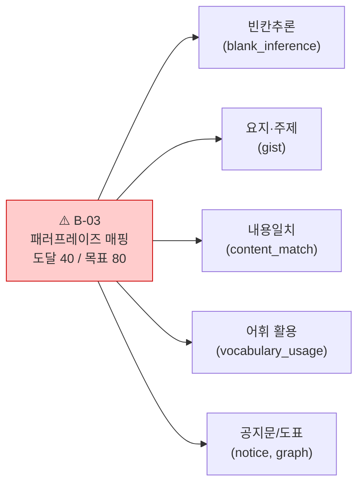

출처: `QUESTION_TYPE_SKILL_MAP` (micro-skills.ts) — 19개 수능 유형이 12개 skill의 조합.

---

## 2-C. 유형 ↔ skill 의존 매트릭스 (요약)

| 수능 유형 | Primary skill | Secondary skill |
|---|---|---|
| 빈칸추론 (blank_inference) | C-02, B-03 | A-01, B-02 |
| 어법 (grammar) | A-02, A-03 | A-04 |
| 주제·제목 | C-01 | C-03 |
| 함의 (implication) | C-02 | B-01, C-04 |
| 문장삽입 | B-02, B-01 | C-04 |
| 어휘 선택 | A-01 | B-03 |

> **시사점:** 같은 "오답 1개"라도 원인이 다르면 처방이 다르다. **분해 없이 처방 없다.**

---

# 3 │ 해결책 — 학습자의 역량 진단

> "어렵다 / 쉽다"가 아니라 **수치로 정의되는 진단**.
> 출처: [`docs/IRT_CALIBRATION_GUIDELINE.md`](https://github.com/smilepat/md-graph-db/blob/main/docs/IRT_CALIBRATION_GUIDELINE.md), 9,017 캘리브레이션 문항.

---

## 3-A. IRT 1PL Rasch — 문항·학습자를 동일 척도 위에

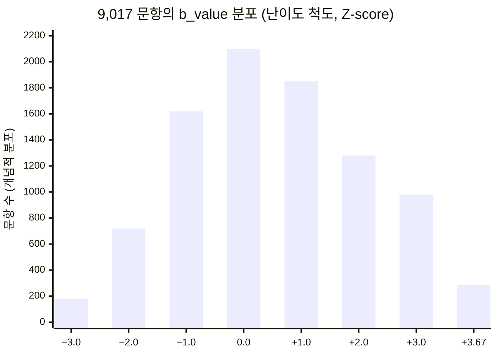

- **b_value 범위:** −3.00 ~ +3.67 (`IRT_CALIBRATION_GUIDELINE.md`)
- **a_value:** 1.0 고정 (Cold-Start, 라쉬)
- 학습자 능력 θ도 같은 척도 → **거리 = (목표 b) − (현재 θ)** 가 그대로 계산됨

---

## 3-B. 적응형 진단 수렴 — 평균 풀이 단계 절반으로

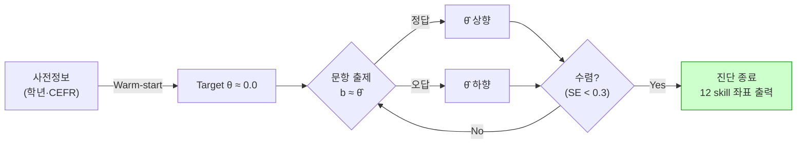

CAT 표준: 고정형 대비 풀이 단계 약 **50% 단축** (Wainer 2000, `logicflow-prd/PRD_RESOURCES.md`).

---

## 3-C. 4단계 마스터리 게이트 — 학습자의 현재 좌표

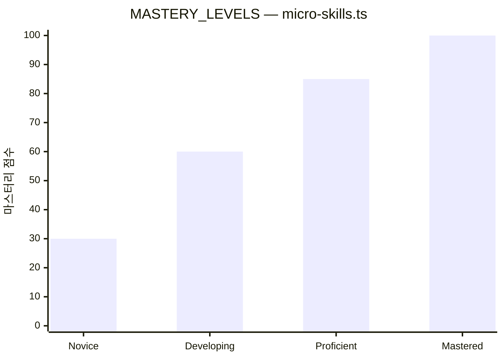

| Level | 점수 | 라벨 | 의미 |
|---|---:|---|---|
| Novice | 0–30 | 입문 | 진단 미실시 또는 핵심 결함 |
| Developing | 31–60 | 발전 | **교과과정 도달의 평균 구간** |
| Proficient | 61–85 | 숙련 | 수능 2–3등급 영역 |
| **Mastered** | **86–100** | **마스터** | **수능 1등급 영역** |

---

# 4 │ 목표까지의 거리와 로드맵

> 12 skill 사이엔 **선수관계(prerequisites)** 가 있다 → 학습 순서가 수학적으로 결정됨.
> 출처: `micro-skills.ts` (`prerequisites` 필드) + `recommender.ts`

---

## 4-A. Skill 선수관계 DAG — 학습 경로의 골격

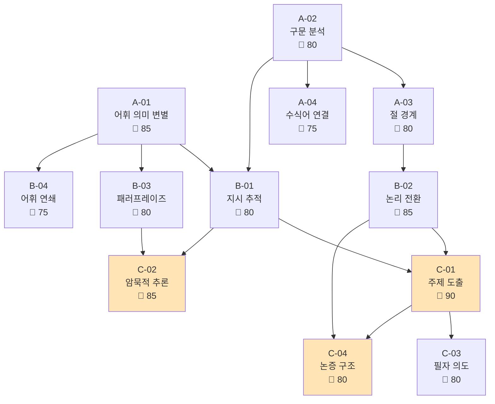

색칠된 노드 = **갭이 −40 이상**인 우선 보강 대상.

---

## 4-B. Recommender 알고리즘 — 우선순위 자동 결정

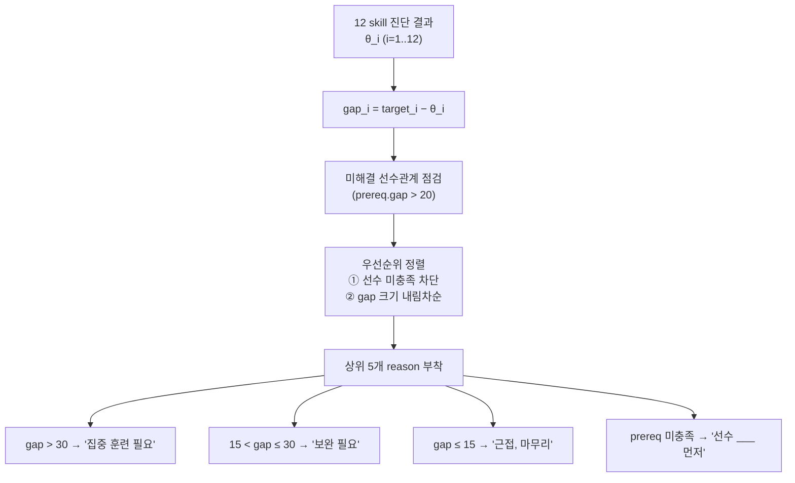

출처: [`csat-text-graph-maker/src/lib/logicflow/recommender.ts`](https://github.com/smilepat/csat-text-graph-maker/blob/main/src/lib/logicflow/recommender.ts) `getRecommendations()`.

---

## 4-C. 학습자 예시: 추천 로드맵 (5단계)

| # | skill | 현재 → 목표 | gap | reason |
|---:|---|---:|---:|---|
| 1 | **A-02** 구문 분석 | 60 → 80 | −20 | 선수 차단(B-02·C-04 진행 불가) |
| 2 | **B-02** 논리 전환 | 45 → 85 | −40 | 집중 훈련 필요 |
| 3 | **B-03** 패러프레이즈 | 40 → 80 | −40 | 5개 유형 동시 영향 |
| 4 | **C-01** 주제 도출 | 55 → 90 | −35 | B-01·B-02 충족 후 진입 |
| 5 | **C-02** 암묵적 추론 | 35 → 85 | −50 | B-03 보강 후 단계 진입 |

> **모든 학습자에게 다른 5개** 가 출력됨 → 일괄 커리큘럼의 종언.

---

# 5 │ 계량화된 기반의 학습 경험 제공

> 진단 좌표가 정해지면, **거기에 정확히 맞는 문항을 거기서 즉시 생성**할 수 있어야 한다.
> 출처: `DATABASE_ARCHITECTURE.md` — 137,745 학습 문항 자산.

---

## 5-A. 학습 문항 자산 — 9,183 × 5D × 3단계

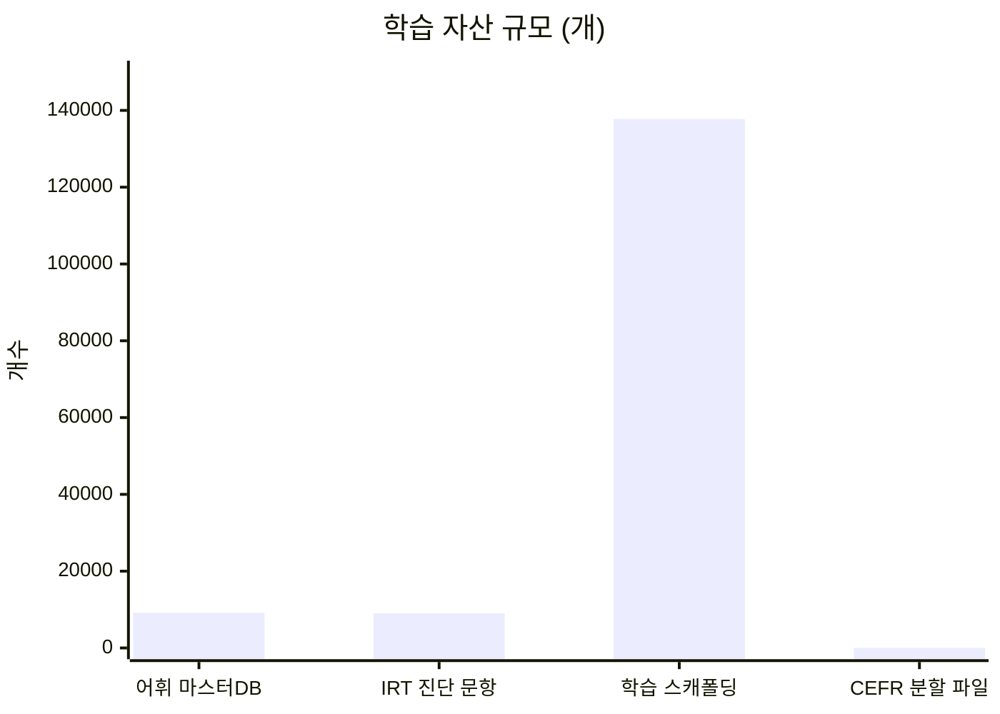

- **마스터 어휘:** 9,183 단어 × 58 속성
- **IRT 진단 문항:** 9,017 (1PL Rasch)
- **학습 스캐폴딩:** **137,745 문항** = 9,183 × 5D × 3 step (Gemini 2.5 Flash × 45,915 호출 생성)
- **배포:** `learning_{Level}.json` × A1~C2 6개

---

## 5-B. 난이도가 좌표로 제어됨 — `learning_step` ↔ `b_value`

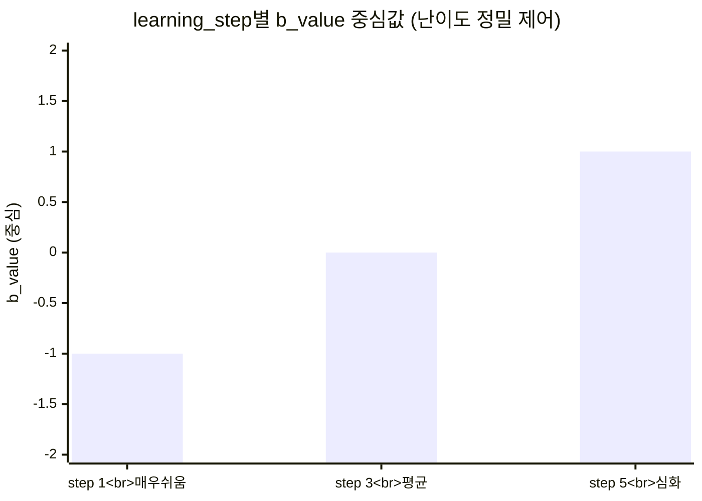

| step | 의미 | b_value | 용도 |
|---:|---|---:|---|
| 1 | 매우 쉬움 | b−1.0 | 자신감 회복·기초 |
| 3 | 평균 | b±0 | 표준 학습 |
| 5 | 심화 | b+1.0 | 1등급 굳히기 |

같은 단어라도 **5D × 3step**로 15가지 학습 패턴 → "어려우면 더 쉬운 같은 단어"가 즉시 출제됨.

---

## 5-C. 2-Stage LLM 파이프라인 — 품질 결정 구조

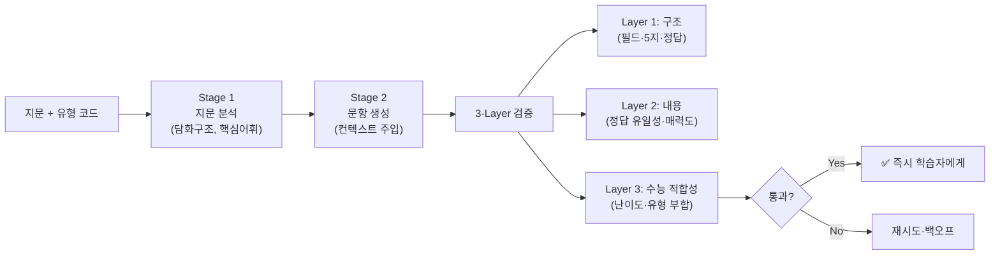

출처: `et-craft/ET-Craft_Presentation.md` (validator_common.js, validator_grammar/gap/chart/set.js).

---

# 6 │ 눈에 보이는 progress

> 진단·학습·재진단의 닫힌 루프 → **점수가 아닌 좌표의 이동**으로 성장을 본다.

---

## 6-A. Before / After — 12 skill 좌표 이동

상단(Before) → 하단(After) 모두 표시. **B-03 패러프레이즈 40→68(+28)** 의 효과로 빈칸·요지·내용일치 유형이 일제히 상승.

---

## 6-B. 마스터리 레벨 이동 — 시각적 카운트

```mermaid
xychart-beta
    title "마스터리 레벨별 skill 수 (Before → After)"
    x-axis ["Novice","Developing","Proficient","Mastered"]
    y-axis "skill 개수" 0 --> 12
    bar [3, 9, 0, 0]
    bar [0, 4, 8, 0]
```

**Before:** Novice 3 / Developing 9 → **After:** Developing 4 / Proficient 8.
다음 8주: **Proficient → Mastered** 게이트 진입 → 수능 1등급 영역.

---

## 6-C. 누적 학습 시간 ↔ θ 상승 — "노력의 가시화"

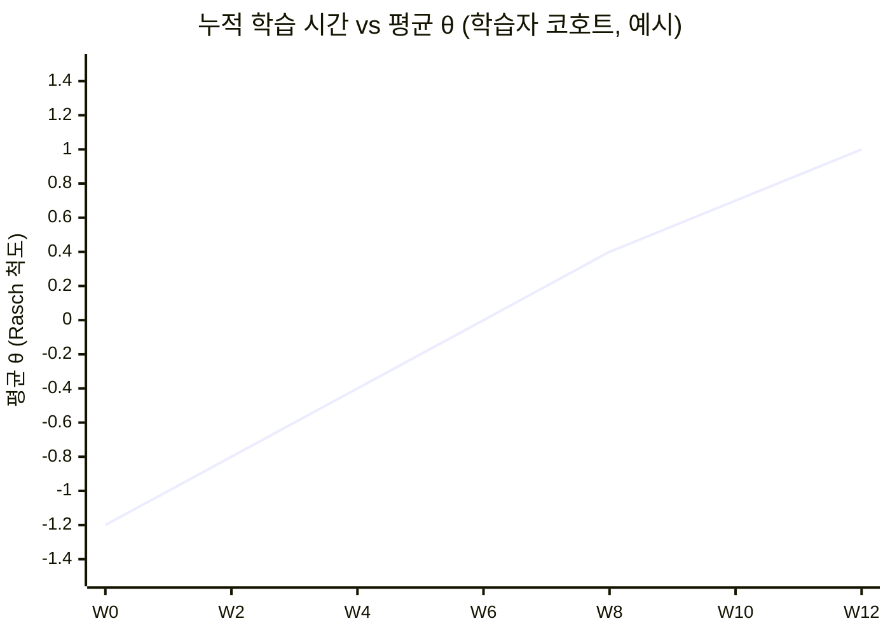

**핵심:** θ가 0.0(=수능 평균 난이도 정답률 50%) → +1.0(=수능 상위권)으로 직진. 학습자·학부모·교사가 같은 좌표축으로 진행을 본다.

---

## 6-D. 진단 → 학습 → 재진단 루프

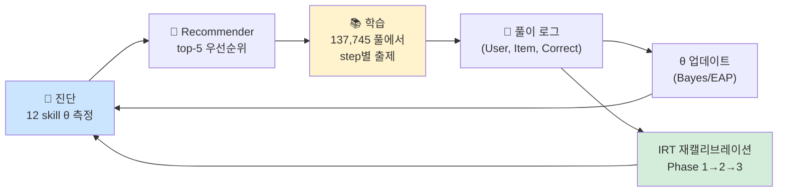

**모트(Moat):** 풀이 로그가 쌓일수록 b·a 파라미터가 한국 학습자에 맞춰 재조정됨 → **데이터 네트워크 효과**.

---

<!-- _class: lead -->

# 한 줄 요약

> **"학습자의 거리, 좌표로 측정한다."**

| 단계 | 핵심 산출 | 근거 레포 |
|---|---|---|
| ① 갭 인식 | Lexile · 어휘 · Bloom 비대칭 | `md-graph-db/et-craft/lecture_v2.md` |
| ② 역량 분해 | 12 micro-skill × 4 mastery | `csat-text-graph-maker/.../micro-skills.ts` |
| ③ 진단 | 1PL Rasch IRT CAT | `md-graph-db/docs/IRT_CALIBRATION_GUIDELINE.md` |
| ④ 로드맵 | Prerequisite DAG + Recommender | `.../logicflow/recommender.ts` |
| ⑤ 학습 | 137,745 문항 × 2-Stage LLM | `md-graph-db/docs/DATABASE_ARCHITECTURE.md` |
| ⑥ Progress | θ 이동 + 마스터리 게이트 | 同上 + `MASTERY_LEVELS` |

---

# 부록 — 데이터 출처 (재현성)

- 12 micro-skill 정의·목표·선수관계 — `csat-text-graph-maker/src/lib/logicflow/micro-skills.ts`
- canonical 결정 — `logicflow-corpus/docs/skill-mapping.md` (D2, 2026-05-17)
- 학습 자산 137,745 · 진단 9,017 · 어휘 9,183 — `md-graph-db/docs/DATABASE_ARCHITECTURE.md`
- IRT 1PL Rasch·b 범위·Warm-start — `md-graph-db/docs/IRT_CALIBRATION_GUIDELINE.md`
- 교과과정 누적 어휘 800/2,300/4,000/6,000 — `ai-english-platform/app/api/dashboard/vocab-level/route.ts`
- Lexile 학년 표 · Bloom 비대칭 · 93초 — `md-graph-db/et-craft/lecture_v2.md`
- Recommender 우선순위·reason — `csat-text-graph-maker/src/lib/logicflow/recommender.ts`
- 2-Stage 파이프라인 · 3-Layer 검증 — `md-graph-db/et-craft/ET-Craft_Presentation.md`

**주의:** 슬라이드 2-A 하단 막대(교과과정 도달치 65/45/35…), 슬라이드 6-A·6-B의 학습자 사례는 정성적 진단에서 역추정한 예시값입니다. 실측 코호트 평균으로 교체 가능합니다.
